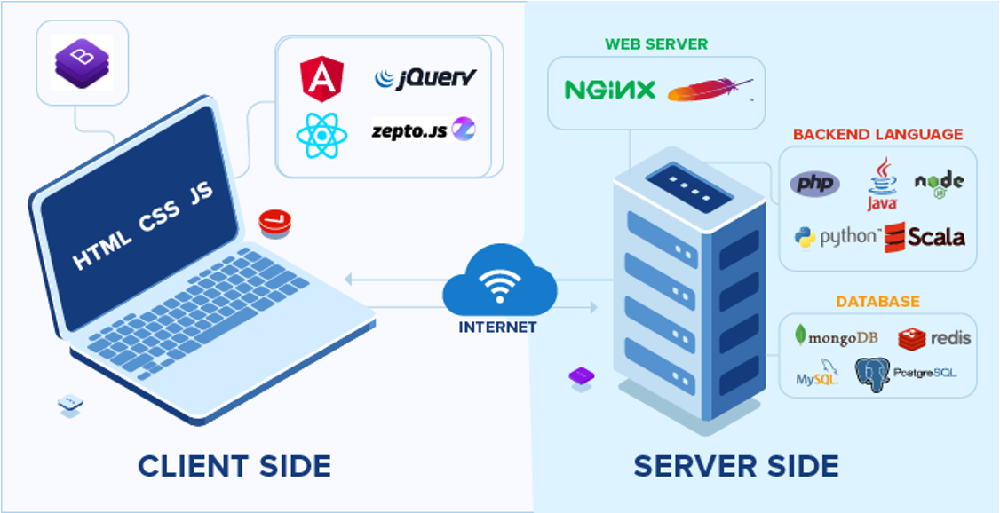
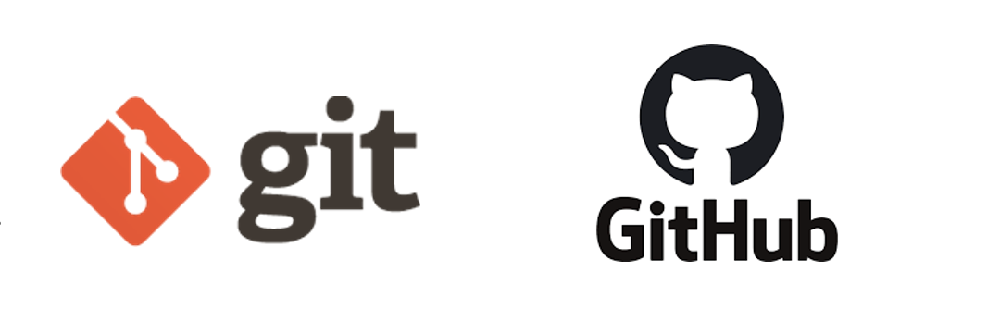
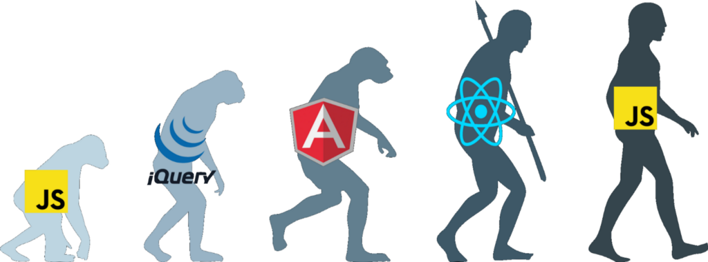

# **UNIDAD 1 - Introducción a las Herramientas de Frontend**

## **1. Diferencia entre Internet y la Web**

#### ¿El Internet === La WWW?


#### El Internet:
- **Definición**: El Internet es una red global de computadoras y otros dispositivos interconectados. Es la infraestructura que permite diversos tipos de comunicación digital e intercambio de datos.
- **Historia**: El desarrollo del Internet comenzó a fines de la década de 1960 con la creación de ARPANET, un proyecto financiado por el Departamento de Defensa de EE.UU. A lo largo de las décadas siguientes, evolucionó hasta convertirse en una red global con la creación de los protocolos TCP/IP en la década de 1980. Posteriormente se crearon protocolos en las diferentes capas de la arquitectura
- **Componentes**: El Internet consta de hardware (servidores, enrutadores, cables) y ciertos estándares y protocolos (TCP/IP, Ethernet).
- **Funciones**: Soporta una amplia gama de servicios como correo electrónico, transferencia de archivos, mensajería instantánea y, por supuesto, la World Wide Web.
- **Analogía**: Piensa en el Internet como la red física de caminos y carreteras.

Para más información, recordad los apuntes de SISI del año pasao. Echadle un ojo a la parte de redes (tercer trimestre, y sobretodo al curso de ccna de Cisco que hicistéis).
#### La World Wide Web (WWW):
- **Definición**: La World Wide Web es una colección de información, accesible a través del Internet, que está formateada e interconectada utilizando hipertexto y hipermedia. Es un servicio que opera sobre el Internet.
- **Historia**: La World Wide Web (WWW), o comunmente conocida como "la Web" fue inventada por Tim Berners-Lee en 1989 mientras trabajaba en CERN. Desarrolló el primer navegador web y servidor web, y el primer sitio web se publicó en 1991. La web creció rápidamente en popularidad a lo largo de la década de 1990, convirtiéndose en una parte importante de la vida cotidiana.
- **Componentes**: La WWW consta de páginas web, sitios web y navegadores web. Las páginas web son documentos escritos en HTML y se accede a través de URLs.
- **Funciones**: Permite a los usuarios acceder y navegar por las páginas web a través de navegadores web (como Chrome, Firefox, Safari). Estas páginas pueden contener texto, imágenes, videos y enlaces a otras páginas.

- **Analogía**: Piensa en la web como un sistema específico de caminos y puntos de referencia (sitios web y páginas web) que existen en las carreteras y autopistas físicas (el Internet).

#### Resumen:
- **Internet**: La red global subyacente que conecta millones de computadoras.
- **La Web**: Un subconjunto del Internet, compuesto por páginas y sitios web, accesibles a través de navegadores web.

La web depende del Internet para funcionar, pero el Internet también soporta muchos otros servicios además de la Web.

## **2. Arquitectura Web**

La arquitectura más común es cliente/servidor.

 - Un **cliente** es un consumidor de servicios. El navegador web en nuestro dispositivo actúa como cliente.
 - Un **servidor** es uno o más procesos alojados en máquinas que proporcionan los servicios consumidos por el cliente. El servicio más utilizado en la WWW es HTTP.

 

## **3. Desarrollo Frontend y Backend**

- **Backend**: La parte de la aplicación web que se ejecuta en el servidor.
- **Frontend**: La parte de la aplicación web que se ejecuta en el cliente.



### **3.1 Desarrollo Backend**

Es el desarrollo llevado a cabo en el lado del servidor. Es responsable de la lógica de negocio y la persistencia de datos (almacenamiento en la base de datos).

Lenguajes de backend:

- Java
- Python
- Node.js
- Ruby
- PHP
- ASP.NET


### **3.2 Desarrollo Frontend**

Es la parte desarrollada para ejecutarse en el cliente (navegador web). El navegador web solo sabe interpretar tres lenguajes:

- **HTML**: Para la estructura y el contenido de la página.
- **CSS**: Define la apariencia de la página web.
- **JavaScript**: Lenguaje que define el comportamiento dinámico.


Actualmente, está ganando mucha prominencia debido al peso creciente de las aplicaciones web en el lado del cliente -> Aplicaciones de una sola página (o comoo se conocen por sus siglas en inglés SPAs -Single Page Aplications).

Una **aplicación de una sola página (SPA)** es una aplicación web o sitio web que interactúa con el usuario al reescribir dinámicamente la página web actual con nuevos datos del servidor web, en lugar del método predeterminado de un navegador web que carga páginas completamente nuevas. El objetivo es transiciones más rápidas que hagan que el sitio web se sienta más como una aplicación nativa. (Fuente: [Wikipedia](https://en.wikipedia.org/wiki/Single-page_application))

Podemos escribir la lógica de nuestra página en Vanilla JS. Pero la complejidad de los proyectos ha hecho necesario que aparezcan varios marcos y bibliotecas de JavaScript:

- Angular
- React
- Vue
- Svelte
- Astro
- Muchos más y muchos más por venir.


  


## **4. Lenguaje JavaScript**

JS es un **lenguaje interpretado** definido como:

- **Orientado a objetos**: JavaScript utiliza objetos para organizar y estructurar el código, asociando propiedades y métodos con datos.

- **Imperativo**: JavaScript ejecuta las instrucciones de forma secuencial para realizar tareas, enfocándose en cómo lograr resultados paso a paso.

- **Basado en prototipos**: En lugar de clases, JavaScript utiliza prototipos como plantillas para crear objetos, permitiendo que los objetos hereden propiedades y métodos directamente de otros objetos.

- **Débilmente tipado**: JavaScript permite tipos de variables flexibles, donde las variables pueden cambiar de tipo durante la ejecución sin declaraciones explícitas. Mucho cuidado con esto!! El nombre de la variable tendrá que ser suficientemente explicativo como para saber qué hace.

- **Tipado dinámico**: Los tipos se determinan en tiempo de ejecución en JavaScript, permitiendo que las variables contengan diferentes tipos de valores a medida que el programa se ejecuta, lo que mejora la flexibilidad pero requiere un manejo cuidadoso para evitar comportamientos inesperados. (Lo de antes, vamos)

Se utiliza principalmente en el **lado del cliente**, implementado como parte del navegador web para mejorar la interfaz web y proporcionar un comportamiento dinámico.

También se puede usar en el **lado del servidor** con **node.js** para crear el backend y muchas otras aplicaciones.

**RECORDATORIO**
> - **Lenguajes compilados**: Un lenguaje compilado es un lenguaje de programación donde el código fuente se traduce completamente a código máquina antes de la ejecución, lo que generalmente resulta en un rendimiento más rápido pero requiere una compilación específica para diferentes plataformas. Ejemplos incluyen C, C++ y Rust.
> - **Lenguajes interpretados**: Un lenguaje interpretado es un lenguaje de programación donde **el código se ejecuta línea por línea mediante un intérprete**, traduciendo cada instrucción a código máquina una a una durante el tiempo de ejecución. Este enfoque mejora la portabilidad entre diferentes sistemas, pero generalmente resulta en un rendimiento más lento en comparación con los lenguajes compilados. Ejemplos incluyen Python, JavaScript y Ruby.

### **4.1 Versiones de JS**

JS es un dialecto de **ECMAScript** y está definido por ese estándar.

**Historia**:

- Fue creado por Brendan Eich para Netscape en **1995**, inicialmente llamado **LiveScript** antes de ser renombrado a JavaScript.
- En **1997**, ECMA creó el **primer estándar ECMAScript**.
- **ECMAScript 5**, ES5, lanzado en **2009**, introdujo muchas mejoras y se mantuvo como un estándar durante muchos años.
- **ECMAScript 6**, también conocido como ES6, lanzado en **2015**, introdujo mejoras importantes como el uso de clases y módulos. Es la versión más ampliamente soportada por todos los navegadores actuales.
- Desde ES6, se ha lanzado una nueva versión cada año. Por ejemplo, la versión para 2023 es ECMAScript 14. Podemos consultar la [historia de versiones de ECMAScript](https://en.wikipedia.org/wiki/ECMAScript_version_history) en Wikipedia o el [sitio oficial de ECMA](https://ecma-international.org/publications-and-standards/standards/) para verificar las versiones más recientes de ECMAScript.


Fuente de la imagen: [Gabriel Lebec @ Course Report](https://www.coursereport.com/blog/history-of-javascript)

### **4.2 TypeScript**

[TypeScript](https://www.typescriptlang.org/) es un superconjunto de JavaScript con tipado estático que se compila a JavaScript plano. Es desarrollado y mantenido por Microsoft. TypeScript agrega tipos estáticos opcionales, clases e interfaces a JavaScript, proporcionando una experiencia de desarrollo robusta para construir aplicaciones a gran escala.


## **5. Herramientas para el desarrollo web frontend**

### **5.1 Editores de texto**

La herramienta más importante para programar será un buen editor de texto.

Podemos encontrar varias opciones en el mercado, desde el antiguo y confiable (pero simple) Notepad++ hasta el muy poderoso VS Code.

- Notepad++
- Sublime Text
- Atom
- VS Code


Usaremos el más extendido hoy en día: [VSCode](https://code.visualstudio.com/). Este potente y útil editor de Microsoft tiene muchas características deseables, como:

- Resaltado de sintaxis
- Multiplataforma: Para Windows, macOS y Linux
- Soporte para depuración
- Control de Git integrado y integración con GitHub
- Integración con GitHub Copilot
- "Snippets" o fragmentos de código reutilizables
- Una multitud de extensiones instalables

**Editores de código en línea**. Tienen la ventaja de no tener que instalar y configurar herramientas en tu computadora. Son muy útiles como un sandbox (entorno controlado).

- [Stackblitz](https://stackblitz.com/)
- [Code Sandbox](https://codesandbox.io/)
- [Code Pen](https://codepen.io/)

### **5.2 Navegadores web**

Los desarrolladores dependen de los navegadores no solo para ver páginas web, sino también para herramientas y capacidades esenciales que ayudan en el desarrollo y la depuración:

- **Herramientas de Desarrollo:** Los navegadores modernos vienen equipados con herramientas de desarrollo (como las Herramientas de Desarrollador de Chrome, Herramientas de Desarrollador de Firefox y el Inspector Web de Safari) que proporcionan características como:
    - Inspección del DOM
    - Inspección de CSS
    - Consola de JavaScript


### **5.3 Herramientas de control de versiones**

Las herramientas de control de versiones son sistemas de software que ayudan a gestionar los cambios en archivos, documentos o cualquier colección de información a lo largo del tiempo. Son esenciales para rastrear modificaciones realizadas por individuos o equipos, facilitar la colaboración y asegurar la integridad y trazabilidad del historial del proyecto. Las herramientas que utilizaremos son:

- **Git**: Git es un sistema de control de versiones distribuido diseñado para velocidad y eficiencia. Permite que varios desarrolladores trabajen en el mismo proyecto simultáneamente y ofrece capacidades de ramificación y fusión. Esta es una herramienta que necesitamos instalar en nuestra computadora: [Git](https://git-scm.com/)



- **GitHub**: GitHub funciona principalmente como una plataforma de alojamiento para repositorios de Git, permitiendo sincronizar nuestro proyecto local de Git con GitHub. Pero podemos ver todos los diferentes propósitos de esta herramienta:
    1. **Control de versiones**: GitHub aloja repositorios de Git, permitiendo a los desarrolladores gestionar y rastrear cambios en su base de código a lo largo del tiempo.

    2. **Colaboración**: Facilita el trabajo en equipo al permitir que varios desarrolladores trabajen en el mismo proyecto simultáneamente, gestionen ramas y fusionen cambios.

    3. **Alojamiento de código**: Proporciona una plataforma para que los desarrolladores alojen y compartan sus repositorios de código fuente, haciéndolos accesibles para su visualización, clonación y contribución.

    4. **Seguimiento de problemas**: Incluye un sistema de seguimiento de problemas para gestionar y resolver errores, tareas y solicitudes de características relacionadas con proyectos.

    5. **Gestión de proyectos**: Ofrece herramientas como tableros de proyectos y hitos para organizar tareas, rastrear el progreso y priorizar elementos de trabajo entre equipos.

    6. **Integración CI/CD**: Se integra con herramientas de CI/CD para automatizar los procesos de construcción, prueba y despliegue, asegurando que los cambios de código sean probados y desplegados de manera eficiente.

    7. **Comunidad y código abierto**: Fomenta una comunidad en torno al desarrollo de software de código abierto, permitiendo a los usuarios descubrir, contribuir y colaborar en proyectos a nivel global.

    8. **Documentación**: Proporciona herramientas para crear y mantener documentación del proyecto, wikis y archivos README para explicar los objetivos del proyecto, instrucciones de uso y directrices de contribución.

**DOCUMENTAR, DOCUMENTAR, DOCUMENTAR!!!**
> - No olvides documentar tu proyecto con un archivo **README.md** escrito en **Markdown**. Markdown es un lenguaje de marcado ligero que se usa comúnmente para formatear texto en la web. Al escribir archivos README en plataformas como GitHub, Markdown proporciona una forma simple y legible de estructurar y dar estilo al texto sin necesidad de escribir HTML directamente.
> - Aprende algo sobre [el lenguaje Markdown](https://www.markdownguide.org/cheat-sheet/)
> 
> - Echa un vistazo a este ejemplo -> [README.md](https://github.com/jeatzr/txt2gift/blob/main/README.md)
> - Las notas actuales que estás leyendo también están escritas en Markdown y luego compiladas por `mkdocs` para generar una documentación bonita. -> [README.md](https://github.com/jeatzr/dwec-bi/blob/main/docs/01_frontend_introduction/README.md)
> - Ejemplo de sintaxis Markdown:
> 

```
# Nombre del Proyecto

Descripción de tu proyecto.

## Instalación

Instrucciones sobre cómo instalar y ejecutar tu proyecto.

## Uso

Ejemplos e instrucciones sobre cómo usar tu proyecto

.

### Ejemplo de Código

```javascript
console.log('¡Hola, Mundo!');
```


### **5.4 Gestores de Paquetes**

Los gestores de paquetes nos ayudan a instalar diversas utilidades, características y frameworks. Facilitan el proceso de agregar, actualizar y gestionar paquetes de software, asegurando que tengamos las dependencias y herramientas necesarias para desarrollar y ejecutar nuestras aplicaciones de manera eficiente. Ejemplos populares son pip para Python y npm para JavaScript. En nuestro caso, para JavaScript, las dos opciones principales son:

- **npm** (Node Package Manager) es el gestor de paquetes predeterminado para [Node.js](https://nodejs.org/en). Ayuda a los desarrolladores a instalar, compartir y gestionar bibliotecas y dependencias de JavaScript para sus proyectos. También proporciona un registro donde los desarrolladores pueden publicar sus propios paquetes.

- **Yarn** es un gestor de paquetes alternativo para JavaScript que se enfoca en la velocidad, seguridad y fiabilidad. Desarrollado por Facebook, Yarn utiliza un archivo de bloqueo para garantizar instalaciones consistentes en diferentes entornos y optimiza el proceso de instalación y actualización de dependencias.


### **5.5 Linters, Transpiladores y Bundlers**

**Linters** son herramientas que analizan tu código para encontrar y corregir errores de programación, fallos, errores de estilo y otros patrones problemáticos. Ayudan a hacer cumplir los estándares de codificación y mejorar la calidad del código. Ejemplos incluyen:

- **ESLint**: Un linter popular para JavaScript y TypeScript que ayuda a identificar y corregir problemas en tu código.
- **JSHint**: Otro linter de JavaScript que detecta errores y problemas potenciales en tu código.


**Transpiladores** son herramientas que convierten código escrito en un lenguaje o versión de programación a otro. A menudo se utilizan para traducir JavaScript moderno (ES6+) a versiones más antiguas que sean compatibles con todos los navegadores. Ejemplos incluyen:

- **Babel**: Un transpilador de JavaScript ampliamente utilizado que convierte código ES6+ en ES5, haciéndolo compatible con navegadores más antiguos.
- **TypeScript Compiler (tsc)**: Convierte código TypeScript en JavaScript, permitiendo a los desarrolladores usar las características de verificación de tipos de TypeScript mientras despliegan JavaScript.
- **Sass**: Un lenguaje de preprocesador de scripts que se interpreta o compila en CSS, facilitando la escritura y mantenimiento de estilos.


**Bundlers** son herramientas que combinan varios archivos y módulos en un solo archivo (o unos pocos archivos) para una distribución y despliegue más sencillos. Manejan las dependencias, optimizan el código y, a menudo, incluyen características como la división de código y la minificación. Ejemplos incluyen:

- **Webpack**: Un potente bundler de módulos para aplicaciones de JavaScript que procesa y combina varios activos como JavaScript, CSS e imágenes.
- **Parcel**: Un bundler de aplicaciones web rápido y sin configuración que funciona directamente sin necesidad de configuración.
- **Rollup**: Un bundler de módulos para JavaScript que compila pequeños fragmentos de código en algo más grande y complejo, a menudo utilizado para construir bibliotecas.


Estas herramientas son esenciales en el desarrollo web moderno, ayudando a mantener la calidad del código, garantizar la compatibilidad en diferentes entornos y optimizar el resultado final para un mejor rendimiento.

### **5.6 Bibliotecas y Frameworks**

**Bibliotecas y frameworks** amplían las capacidades y simplifican el uso de JavaScript (JS) o CSS. Proporcionan código preescrito para realizar tareas comunes, ayudando a los desarrolladores a construir aplicaciones de manera más eficiente y con menos errores.

- [**Bootstrap**](https://getbootstrap.com/): Un framework de CSS que simplifica la creación de elementos de interfaz web.
- [**jQuery**](https://jquery.com/): Una biblioteca de JavaScript que facilita el uso de JS y mejora la compatibilidad. Un poco anticuada y innecesaria, pero aún se utiliza en sitios web heredados.

#### Frameworks

- [**Angular**](https://angular.dev/): Un framework de JS creado por Google que facilita la creación de Aplicaciones de Página Única (SPA) y sigue el patrón MVC (Modelo-Vista-Controlador). Es ampliamente utilizado y tiene una gran comunidad.
- [**Vue.js**](https://vuejs.org/): Un framework de JS de código abierto también diseñado para crear SPAs.
- [**React**](https://react.dev/): Una biblioteca de JS de código abierto creada por Facebook. Se utiliza principalmente para definir la capa de Vista, aunque puede funcionar con extensiones para definir más partes de la arquitectura de la aplicación. También se utiliza para crear SPAs.




**Algunos otros memes :)** [Meme de la guerra de frameworks](img/meme2.jpg) - [Meme de jQuery](img/jquery_meme.jpg)

<div class="exercise-box">
<h3><i class="fas fa-laptop-code"></i> Ejercicio Práctico 1.1</h3>
<p>Consulta <a href="https://stateofjs.com/">Estado del Arte de Javascript</a> y comenta. (Está en inglés, pero por suerte o desgracia, en informática todo se escribe en inglés)</p>
<p>Investiga diferentes frameworks y selecciona uno que utilizarías para construir una Aplicación de Página Única (SPA). Explica las razones que te convencieron.</p>
</div>

## **6. Incluir Código JavaScript**

Tenemos varias formas de incluir código JavaScript en nuestra página web:

1. **JavaScript Interno**
   
    Puedes incluir JavaScript dentro de la sección `<head>` o `<body>` de tu archivo HTML usando la etiqueta `<script>`. Si deseas asegurarte de que el código se ejecute una vez que se haya analizado todo el documento, se recomienda incluir esta etiqueta al final de `<body>`.

    ```html
    <!DOCTYPE html>
    <html lang="es">
    <head>
        <meta charset="UTF-8">
        <meta name="viewport" content="width=device-width, initial-scale=1.0">
        <title>Ejemplo de JavaScript Interno</title>
        
    </head>
    <body>
        <h1>Ejemplo de JavaScript Interno</h1>
        <script>
            alert("¡Hola, Mundo!");       
        </script>
    </body>
    </html>
    ```

2. **JavaScript Externo**

    Puedes incluir JavaScript desde un archivo externo usando la etiqueta `<script>` con el atributo `src`. Al igual que con el JavaScript interno, la posición de la etiqueta `<script>` dentro del documento HTML es importante.

    ```html
    <!DOCTYPE html>
    <html lang="es">
    <head>
        <meta charset="UTF-8">
        <meta name="viewport" content="width=device-width, initial-scale=1.0">
        <title>Ejemplo de JavaScript Externo</title>
    </head>
    <body>
        <h1>Ejemplo de JavaScript Externo</h1>
        <script src="script.js"></script>
    </body>
    </html>
    ```

    **script.js**:
    ```js
    alert("¡Hola, Mundo!");
    console.log("¡Hola Mundo!!!")
    ```

3. **Atributos Defer y Async**
    Puedes usar los atributos `defer` o `async` en la etiqueta `<script>` para controlar el comportamiento de carga de tu JavaScript.

      - `defer`: El script se ejecutará después de que el HTML se haya analizado completamente. Esto nos añade dos ventajas: por una parte, la carga de la página no se queda 'parada' proque haya que cargar un script 'gordo' (que los hay, de hecho es lo más común); y dos, cuando el script se ejecuta es seguro que toda la página (con los objetos correspondientes a las etiquetas) está cargada y son accesibles al script. El uso de `defer` nos da más control sobre la ejecución de los scripts porque `defer` mantiene el orden de ejecución si tienes múltiples scripts.
      - `async`: El script se ejecutará de manera asíncrona tan pronto como esté disponible. Se ejecuta a su "bola", y si hay varios scripts marcados con `async`, se van a ejecutar todos en hilos (procesos) independientes al proceso de carga de la página principal.

    ```html
    <!DOCTYPE html>
    <html lang="es">
    <head>
        <meta charset="UTF-8">
        <meta name="viewport" content="width=device-width, initial-scale=1.0">
        <title>Ejemplo de Defer y Async</title>
        <script src="defer-script.js" defer></script>
        <script src="async-script.js" async></script>
    </head>
    <body>
        <h1>Ejemplo de Defer y Async</h1>
    </body>
    </html>
    ```

    **defer-script.js**

    ```js
    console.log("Script Defer Cargado");
    ```

    **async-script.js**

    ```js
    console.log("Script Async Cargado");
    ```

    La alternativa sin usar estos atributos, es poner los scripts justo antes de la etiqueta de cierre del  `</body>`.

    ```js
    <body>
         ...todo el contenido está arriba del script...

         <script src="./miscript.js"></script>
    </body>
    ```

    Colocar tus etiquetas de script justo antes de la etiqueta de cierre `</body>` asegura que el script se ejecute después de que se haya analizado el HTML. Sin embargo, esto no garantiza inherentemente el orden de ejecución si tienes múltiples scripts y comportamiento asíncrono. 

    Aun así, en nuestro caso, cualquiera de las dos opciones es válida para preservar la ejecución del script una vez que el documento HTML esté totalmente analizado.


4. **Manejadores de Eventos en Atributos HTML**
   
    Puedes incluir JavaScript directamente dentro de los atributos HTML, como `onclick`, `onload`, etc. No es una buena práctica, solo en algunos casos específicos.

    ```html
    <!DOCTYPE html>
    <html lang="es">
    <head>
        <meta charset="UTF-8">
        <meta name="viewport" content="width=device-width, initial-scale=1.0">
        <title>Ejemplo de Manejadores de Eventos</title>
    </head>
    <body>
        <h1>Ejemplo de Manejadores de Eventos</h1>
        <button onclick="alert('¡Hola, Mundo!')">Haz Clic Aquí</button>
    </body>
    </html>
    ```

## **7. Bootstrap**

#### ¿Qué es Bootstrap?

Bootstrap es un popular framework de código abierto para el desarrollo de **sitios web responsivos y orientados a móviles**. Proporciona una colección de componentes de CSS y JavaScript que te ayudan a diseñar y construir interfaces de usuario de manera rápida y eficiente. Bootstrap está diseñado para simplificar el proceso de creación de diseños consistentes y visualmente atractivos en diferentes dispositivos y tamaños de pantalla.

#### Características Clave:
- **Sistema de Cuadrícula Responsiva**: Ajusta automáticamente el diseño según el tamaño de la pantalla, asegurando que tu sitio web se vea bien en todos los dispositivos.
- **Componentes Pre-estilizados**: Incluye una amplia gama de componentes listos para usar, como botones, formularios, barras de navegación y modales.
- **Personalizable**: Permite la personalización de componentes y estilos utilizando variables y temas.
- **Plugins de JavaScript**: Viene con plugins de JavaScript integrados para funcionalidad adicional, como carruseles, tooltips y modales.

#### Cómo Usar Bootstrap:

1. **Formas de Incluir Bootstrap en Tu Proyecto:**
    - **Descargar Bootstrap**: Puedes descargar los archivos compilados de Bootstrap manualmente y agregarlos a tu archivo HTML.
    - **A través de CDN**: Puedes agregar los enlaces de CDN a los archivos CSS y de scripts en el archivo HTML sin descargarlos.
    - **Instalar dependencias**: Puedes instalar las dependencias en el proyecto con `npm i bootstrap@5.3.3`. En este caso, el gestor de paquetes de Node mantiene el control de los archivos.
    - **Usar Snippet de Bootstrap**: Puedes usar, por ejemplo, el snippet `bs5-$` en el editor VSCode. La plantilla Bs5 escribirá todos los enlaces de CDN por ti.

   Obtén más información en: [getbootstrap.com](https://getbootstrap.com).

2. **Usar Componentes de Bootstrap:**

    - **Sistema de Cuadrícula**: Crea diseños responsivos utilizando el sistema de cuadrícula de Bootstrap. Por ejemplo:
     ```html
     <div class="container">
         <div class="row">
             <div class="col-md-6">Columna 1</div>
             <div class="col-md-6">Columna 2</div>
         </div>
     </div>
     ```
    - **Componentes**: Utiliza componentes pre-estilizados como botones, formularios y barras de navegación:
     ```html
     <button type="button" class="btn btn-primary">Botón Primario</button>
     ```

3. **Personalizar Bootstrap:**
    - **Sobrescribir Predeterminados**: Personaliza los estilos de Bootstrap agregando tus propias reglas CSS después del enlace CSS de Bootstrap en tu HTML.
    - **Usar las Herramientas de Personalización de Bootstrap**: Modifica las variables de Bootstrap y recompila el CSS si estás utilizando una herramienta de construcción.

4. **Usar Snippets de B5 en Visual Studio Code:**
    - **Instalar la Extensión Bootstrap 5 Quick Snippets**: Para agilizar tu proceso de desarrollo, instala la extensión **Bootstrap 5 Quick Snippets** para Visual Studio Code. Esta extensión proporciona fragmentos de código para Bootstrap 5, permitiéndote insertar rápidamente componentes y clases de Bootstrap en tu código.
    - **Usar Snippets**: Una vez instalada, puedes usar los snippets para insertar código de Bootstrap. Por ejemplo:
     - Escribe `bs5-$` y presiona `Tab` para crear la plantilla completa del documento HTML.
     - Escribe `bs5-navbar-default` y presiona `Tab` para insertar un snippet de barra de navegación de Bootstrap.
     - Escribe `bs5-button-default` y presiona `Tab` para insertar un snippet de botón predeterminado de Bootstrap.

#### Recursos:
   - **Documentación Oficial**: [Documentación de Bootstrap](https://getbootstrap.com/docs/)
   - **Ejemplos y Plantillas**: Explora varios ejemplos y plantillas de Bootstrap para comenzar rápidamente.
   - **Snippets de B4 para VSCode**: [Extensión B5 Quick Snippets](https://marketplace.visualstudio.com/items?itemName=anbuselvanrocky.bootstrap5-vscode)


