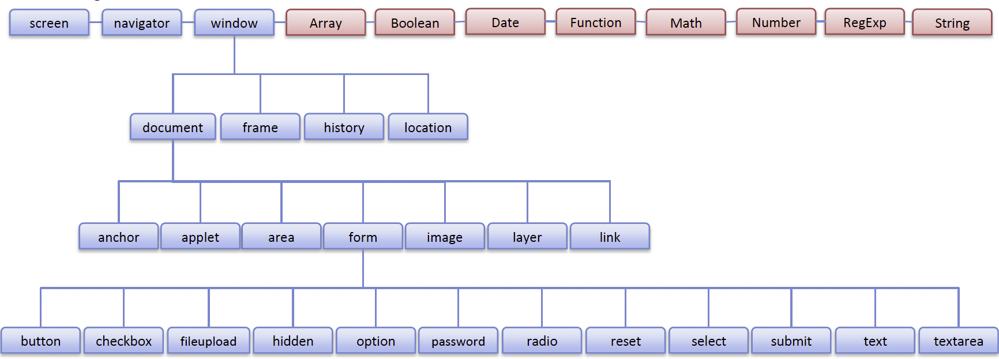

# **UNIDAD 2 - Fundamentos de JavaScript**

## **1. Sintaxis General de JavaScript**
#### Sintaxis de ECMAScript
JavaScript, también conocido como ECMAScript, tiene una sintaxis similar a lenguajes como C++ y Java.

#### Comentarios de una sola línea
Usa `//` para escribir comentarios en una sola línea.

```javascript
// Esto es un comentario de una sola línea
```

#### Comentarios de varias líneas
Usa `/* ... */` para escribir comentarios que abarquen varias líneas.
```javascript
/* Esto es 
un comentario
multilínea
*/
```

#### Puntos y comas
El punto y coma (`;`) al final de una línea es opcional, pero se recomienda para evitar posibles problemas durante la ejecución del código.

```js
let x = 5;  // Se recomienda el punto y coma
```

#### Palabras reservadas
No utilices palabras clave reservadas para nombres de variables, ya que tienen un significado especial en el lenguaje.
```js
// Incorrecto
let for = 10;  // 'for' es una palabra reservada

// Correcto
let count = 10;
```

Lista de palabras reservadas: [https://developer.mozilla.org/en-US/docs/Web/JavaScript/Reference/Lexical_grammar#reserved_words](https://developer.mozilla.org/en-US/docs/Web/JavaScript/Reference/Lexical_grammar#reserved_words)

#### Tipado débil
JavaScript es un lenguaje de tipado débil, lo que significa que no necesitas declarar explícitamente los tipos de datos.
```js
let variable = 10;   // No es necesario declarar el tipo, es un número
variable = "texto";   // Ahora es una cadena
```

Gramática léxica: [https://developer.mozilla.org/en-US/docs/Web/JavaScript/Reference/Lexical_grammar](https://developer.mozilla.org/en-US/docs/Web/JavaScript/Reference/Lexical_grammar)


## **2. Mensajes en consola y alertas en el navegador**

### **2.1 Consola de depuración**

Podemos ver la consola en el navegador seleccionando la opción "Inspeccionar".
Podemos interactuar con el objeto de consola del sistema invocando sus métodos.

```js
console.log('¡Hola Mundo!');           // mensaje general
console.info('Este es un mensaje informativo'); // mensaje informativo
console.warn('¡Ten cuidado!');            // mensaje de advertencia
console.error('Error fatal');           // mensaje de error
```

#### Declaración `debugger`
La declaración `debugger` se puede utilizar para pausar la ejecución de un script con fines de depuración.

Usando la declaración `debugger`, puedes pausar la ejecución del código en un punto específico para inspeccionar el estado actual de las variables y la pila de llamadas.

```javascript
function add(a, b) {
    debugger;  // La ejecución se detendrá aquí 
                //si las herramientas de desarrollo están abiertas
    return a + b;
}
add(2, 3);
```
Cuando la ejecución del código alcanza la declaración `debugger`, se pausará, permitiéndote usar las herramientas de desarrollo del navegador para inspeccionar el estado actual y depurar tu código de manera efectiva.

### **2.2 Alertas, Prompt y Confirmaciones**

Estos métodos se utilizan para mostrar alertas en el navegador, solicitar datos y confirmar acciones con un cuadro de diálogo de OK/Cancelar.

#### alert()
El método `alert()` muestra un cuadro de alerta con un mensaje especificado y un botón OK.

```javascript
alert("¡Este es un mensaje de alerta!");
```

#### prompt()
El método `prompt()` muestra un cuadro de diálogo con un mensaje solicitando al usuario que ingrese algún texto. Devuelve el texto ingresado por el usuario o `null` si el usuario presionó Cancelar.

```js
let userInput = prompt("Por favor, introduce tu nombre:");
console.log("El usuario ingresó: " + userInput);
```

#### confirm()
El método `confirm()` muestra un cuadro de diálogo con un mensaje especificado, junto con un botón OK y un botón Cancelar. Devuelve `true` si el usuario presionó OK, y `false` si presionó Cancelar.

```js
let userConfirmed = confirm("¿Realmente deseas eliminar este elemento?");
if (userConfirmed) {
    console.log("El usuario confirmó la acción.");
} else {
    console.log("El usuario canceló la acción.");
}
```

#### Mejores Prácticas
Debemos intentar evitar el uso de estos métodos siempre que sea posible. Interrumpen la experiencia del usuario y generalmente se consideran una mala práctica en el desarrollo web moderno. Los utilizaremos por ahora, ya que aún no conocemos otras formas de comunicación dinámica con el usuario.

## **3. Declaración de variables**

Podemos declarar variables de tres maneras:

#### **var**

La forma tradicional de declarar una variable. No se recomienda hoy en día. 

Las variables declaradas con `var` dentro de una función son de **ámbito de función**, lo que significa que son accesibles a lo largo de la función en la que se declaran, pero no fuera de ella.

`var` creará variables de **ámbito global** cuando se declaren fuera de una función o en el ámbito global.

```js
var globalVar = "Soy accesible desde cualquier lugar en el script";
function testVar() {
    var functionVar = "Soy accesible solo dentro de esta función";
    console.log(globalVar);  // Muestra: Soy accesible desde cualquier lugar en el script
    console.log(functionVar);  // Muestra: Soy accesible solo dentro de esta función
}
console.log(globalVar);  // Muestra: Soy accesible desde cualquier lugar en el script
// console.log(functionVar);  // Error de referencia no capturado: functionVar no está definida
```

#### **let**

Una variable que solo es accesible dentro del bloque, sentencia o expresión donde se declara. `let` tiene **ámbito de bloque**.

```js
function testLet() {
    let blockVar = "Soy accesible solo dentro de este bloque";
    if (true) {
        let innerBlockVar = "Soy accesible solo dentro de este bloque interno";
        console.log(blockVar);  // Muestra: Soy accesible solo dentro de este bloque
        console.log(innerBlockVar);  // Muestra: Soy accesible solo dentro de este bloque interno
    }
    console.log(blockVar);  // Muestra: Soy accesible solo dentro de este bloque
    // console.log(innerBlockVar);  // Error de referencia no capturado: innerBlockVar no está definida
}
```

#### **const**

Una constante que solo es accesible dentro del bloque, sentencia o expresión donde se declara. Las constantes no se pueden reasignar después de su declaración inicial. `const` tiene **ámbito de bloque**.

```js
function testConst() {
    const constantVar = "Soy una constante dentro de este bloque";
    if (true) {
        const innerConstantVar = "Soy una constante dentro de este bloque interno";
        console.log(constantVar);  // Muestra: Soy una constante dentro de este bloque
        console.log(innerConstantVar);  // Muestra: Soy una constante dentro de este bloque interno
    }
    console.log(constantVar);  // Muestra: Soy una constante dentro de este bloque
    // console.log(innerConstantVar);  // Error de referencia no capturado: innerConstantVar no está definida
    // constantVar = "Nuevo valor";  // Error de tipo no capturado: Asignación a una variable constante.
}
```

#### **Mejores Prácticas**

Se recomienda usar `let` o `const` dependiendo de si el valor de la variable debe cambiar o no.

- Usa `let` para variables que cambiarán.
- Usa `const` para variables que no deben cambiar.

```js
let variableMutable = "Puedo cambiar";
variableMutable = "He cambiado";

const variableInmutable = "No puedo cambiar";
// variableInmutable = "Intentando cambiar";  // Error de tipo no capturado: Asignación a una variable constante.
```


Aquí tienes la traducción del texto al español:

---

## **4. Tipos de Datos Primitivos**

JavaScript tiene varios tipos de datos primitivos:

- **Number (Número):** Representa tanto números enteros como números de punto flotante.
  
- **String (Cadena):** Representa una secuencia de caracteres (texto).

- **Boolean (Booleano):** Representa una entidad lógica y puede tener dos valores: `true` o `false`.

- **Undefined (Indefinido):** Indica que una variable ha sido declarada pero aún no se le ha asignado un valor.
  
- **Null (Nulo):** Representa la ausencia intencional de cualquier valor de objeto. Es uno de los valores primitivos de JavaScript y se trata como un valor "falso" en operaciones booleanas.

#### Nota:
- **Undefined:** `undefined` significa que una variable ha sido declarada pero aún no se le ha asignado un valor.
- **Null:** `null` es un valor asignado. Puede ser asignado a una variable como representación de la ausencia de valor.

Estos son los bloques de construcción básicos de los datos en JavaScript. Entender y usar estos tipos de datos correctamente es crucial para programar de manera efectiva en JavaScript.

### **4.1 Tipo Número**

En JavaScript, el tipo de datos `number` representa tanto números enteros como números de punto flotante.

#### Características de los Números

- **Números Positivos o Negativos:**

  ```javascript
  let numeroPositivo = 4;
  let numeroNegativo = -30;
  ```

- **Números con o sin decimales**

```js
let entero = 34;
let puntoFlotante = 34.4;
let cero = 0;
let flotanteNegativo = -9.45;
let numeroGrande = 150000000;
```

#### Operaciones Aritméticas

Puedes realizar varias operaciones aritméticas con números:

- Adición `+`
- Sustracción `-`
- Multiplicación `*`
- División `/`
- Módulo `%`: Devuelve el resto de una división.
- Exponenciación `**`: Eleva el primer operando a la potencia del segundo operando.
- Incremento `++`: Aumenta el valor de una variable en 1.
- Decremento `--`: Disminuye el valor de una variable en 1.
  
```js
let suma = 4 + 5;  // 9
let resta = 10 - 3;  // 7
let producto = 4 * 3;  // 12
let cociente = 12 / 4;  // 3

let potencia = 2 ** 3;  // 8

let contador = 0;
contador++;  // el contador ahora es 1

contador--;  // el contador ahora es 0
```

#### Operaciones de Comparación

También puedes comparar números utilizando varios operadores de comparación:

-  Menor que `<`
-  Mayor que `>`
-  Menor o igual que `<=`
-  Mayor o igual que `>=`
-  Igual a `==`
-  Estrictamente igual a `===`
-  Distinto de `!=`
-  Estrictamente distinto de `!==`

```js
let esMenorQue = 5 < 10;  // true
let esMayorQue = 10 > 5;  // true
let esMenorOIgualQue = 5 <= 5;  // true
let esMayorOIgualQue = 10 >= 10;  // true
let esIgual = 5 == '5';  // true (coerción de tipos)
let esEstrictamenteIgual = 5 === 5;  // true
let esEstrictamenteIgualConTiposDiferentes = 5 === '5';  // false (sin coerción de tipos)
let esDistinto = 5 != '5';  // false (coerción de tipos)
let esEstrictamenteDistinto = 5 !== '5';  // true (sin coerción de tipos)
```
[--> Comparaciones de igualdad y semejanza](https://developer.mozilla.org/en-US/docs/Web/JavaScript/Equality_comparisons_and_sameness)

#### Métodos Adicionales para Números en el Objeto Math

JavaScript también proporciona varios métodos incorporados para trabajar con números a través del [Objeto Math](#62-math-object).

<div class="exercise-box">
<h3><i class="fas fa-laptop-code"></i> Ejercicio Práctico</h3>
<p>En JavaScript no hay un operador para calcular la <strong>división entera</strong>. ¿Puedes implementar una forma de obtener esta operación utilizando las operaciones enumeradas arriba?</p>
<p>Ejemplos:</p>
<ul>
  <li>10 // 3 = 3</li>
  <li>13 // -3 = -4</li>
</ul>
</div>

#### Más sobre el tipo número

- `typeof`: Tipo de la variable
- `NaN`: Not-a-Number (No es un número)
- `isNaN()`: Comprueba si el valor es NaN
- `.toString()`: Convierte un número a cadena
- `.toFixed()`: Formatea un número a un número fijo de decimales

```js
// Tipo de la variable
let tipoDeNumero = typeof 123;  // 'number'
let tipoDeCadena = typeof '123';  // 'string'

// NaN (No es un número)
let noEsUnNumero = NaN;
let chequeoNaN1 = isNaN(123);  // false
let chequeoNaN2 = isNaN(NaN);  // true
let chequeoNaN3 = isNaN('Hola');  // true

// Convertir número a cadena
let numeroACadena = (123).toString();  // '123'

// Formatear número a decimales fijos
let decimalFijo = (123.456).toFixed(2);  // '123.46'
```

### **4.2 Tipo Cadena**

En JavaScript, el tipo de datos `string` se utiliza para representar datos textuales.

#### Características de las Cadenas

- **Cadenas:** Una secuencia de caracteres encerrada entre comillas.
  - Comillas dobles: `"Hola mundo"`
  - Comillas simples: `'Hola mundo'`

#### Operaciones con Cadenas

- **Concatenación:** Combinar múltiples cadenas en una sola.
    - Ejemplo: `cadena = 'Hola' + ' mundo'` da como resultado `'Hola mundo'`
- **Operaciones de Comparación:** Comparar cadenas.
    - Igual a (`==`)
    - Estrictamente igual a (`===`)
    - Distinto de (`!=`)
- **Otros Métodos Útiles:** Se pueden encontrar en el [Objeto String](#64-string-object)

```js
// Características de las cadenas
let cadena1 = "Hola mundo";
let cadena2 = 'Hola mundo';

// Concatenación
let saludo = 'Hola' + ' mundo';  // 'Hola mundo'

// Operaciones de Comparación
let esIgual = 'Hola' == 'Hola';  // true
let esEstrictamenteIgual = 'Hola' === 'Hola';  // true
let esEstrictamenteIgual2 = '123' === 132;  // false
let esDistinto = 'Hola' != 'Mundo';  // true

// Otros métodos útiles
let longitudDeCadena = saludo.length;  // 10
let enMayusculas = saludo.toUpperCase();  // 'HOLA MUNDO'
let enMinusculas = saludo.toLowerCase();  // 'hola mundo'
let incluyePalabra = saludo.includes('mundo');  // true
let dividirCadena = saludo.split(' ');  // ['Hola', 'mundo']
let subCadena = saludo.substring(1, 4);  // 'ola'  substring(inicio, fin+1)
let caracterEn = saludo.charAt(1);  // 'o'
let indiceDelCaracter = saludo.indexOf('m');  // 5
let cadenaReemplazada = saludo.replace('mundo', 'todos');  // 'Hola todos'
let cadenaRecortada = '   Hola mundo   '.trim();  // 'Hola mundo'
```

#### Literales de Plantilla

Los literales de plantilla, también conocidos como cadenas de plantilla, son una característica de JavaScript que permite la interpolación de expresiones y la creación de cadenas en varias líneas. Se encierran entre comillas invertidas (`` ` ``) en lugar de comillas simples o dobles.

```js
let texto = `¡Hola, mundo!`;
```

#### Características de los Literales de Plantilla

1. **Interpolación de Cadenas:** Insertar expresiones dentro de una cadena usando la sintaxis `${expresión}`.

```js
let nombre = "Juan";
let apellido = "Pérez";
let edad = 30;
let presentacion = `Mi nombre es ${nombre} ${apellido} y tengo ${edad} años.`;

let resultado = `2 + 2 es ${2 + 2}`;  // "2 + 2 es 4"
```

2. **Cadenas Multilínea:** Crear cadenas que ocupan varias líneas.

```js
let direccion = `Calle Falsa 123
Ciudad Springfield
62704`;
```

<div

 class="exercise-box">
    <h3><i class="fas fa-laptop-code"></i> Ejercicio Práctico: Trabajando con Cadenas en JavaScript</h3>
    <p>Sigue estos pasos para completar el ejercicio:</p>
    <ol>
        <li><strong>Concatenación y Literales de Plantilla</strong>:
            <ul>
                <li>Crea dos variables de cadena, <code>nombre</code> y <code>apellido</code>.</li>
                <li>Concáténalos usando tanto el operador <code>+</code> como literales de plantilla para formar un nombre completo.</li>
            </ul>
        </li>
        <li><strong>Métodos de Cadenas</strong>:
            <ul>
                <li>Usa los métodos <code>.toUpperCase()</code> y <code>.toLowerCase()</code> para cambiar el caso del nombre completo.</li>
                <li>Extrae una subcadena del nombre completo usando los métodos <code>substring()</code> y <code>slice()</code>.</li>
            </ul>
        </li>
        <li><strong>Interpolación de Cadenas</strong>:
            <ul>
                <li>Crea una cadena multilínea usando literales de plantilla que incluya el nombre completo y una dirección.</li>
            </ul>
        </li>
        <li><strong>Dividiendo y Recortando Cadenas</strong>:
            <ul>
                <li>Crea una cadena que incluya una lista de elementos separados por comas.</li>
                <li>Divide la cadena en un arreglo y recorta los espacios en blanco de cada elemento.</li>
            </ul>
        </li>
        <li><strong>Chequeo y Conversión</strong>:
            <ul>
                <li>Crea una variable que incluya un número como cadena.</li>
                <li>Verifica si es un número usando <code>isNaN()</code> y conviértelo a número.</li>
                <li>Usa <code>.toString()</code> para convertir un número de nuevo a una cadena.</li>
                <li>Usa <code>.toFixed()</code> para formatear un número a dos decimales.</li>
            </ul>
        </li>
    </ol>
</div>


### **4.3 Tipo Booleano**

- Solo acepta dos valores: `true` o `false`
- Es útil para verificar el estado de la aplicación
- Se recomienda que su nombre defina el estado positivo
    - Ejemplo: `userIsLogged`, `itemFound`, `errorFound` 

- `Boolean(value);` devuelve el valor booleano de una condición o variable.

#### Boolean()

`Boolean(value);` devuelve el valor booleano de una condición o variable.

#### Verdadero vs Falso

| Verdadero    | Falso        |
| ------------ | ------------ |
| 1            | 0, -0        |
| `"Cualquiera"` | `""`       |
| 3.14         | NaN          |
| `100 > 5`    | null         |
| `1 < 100`    | undefined    |
| `'1' == 1`   | `'1' === 1` |

```js
// Ejemplo 1: Usando Boolean() para obtener el valor booleano
console.log(Boolean(1));           // true
console.log(Boolean(0));           // false
console.log(Boolean("Cualquiera"));  // true
console.log(Boolean(""));          // false

// Ejemplo 2: Usando expresiones
console.log(100 > 5);              // true
console.log(1 < 100);              // true
console.log('1' == 1);             // true
console.log('1' === 1);            // false

// Ejemplo 3: Verificación de undefined y null
let a;
console.log(Boolean(a));           // false

let b = null;
console.log(Boolean(b));           // false

// Ejemplo 4: Verificación de NaN
let c = NaN;
console.log(Boolean(c));           // false
console.log(isNaN(c));             // true

// Ejemplo 5: Combinando múltiples verificaciones
let value = "Hola";
if (value && typeof value === "string") {
    console.log("El valor es una cadena no vacía"); // Esto se imprimirá
}

let number = 0;
if (!number) {
    console.log("El número es cero o falso"); // Esto se imprimirá
}
```

### **4.4 Tipos Undefined y Null**

En JavaScript, `undefined` y `null` son dos tipos distintos que representan la ausencia de valor o no existencia. A menudo se confunden entre sí pero tienen significados y casos de uso diferentes.

#### Undefined
- **Tipo**: `undefined`
- **Descripción**: Una variable que ha sido declarada pero aún no se le ha asignado un valor tiene el valor `undefined`.
- **Ejemplo**:
    ```javascript
    let a;
    console.log(a); // Salida: undefined
    ```

#### Null
- **Tipo**: `object`
- **Descripción**: `null` es un valor de asignación que se puede utilizar para representar la ausencia de valor o de objeto. Se establece explícitamente por el programador para indicar "sin valor".
- **Ejemplo**:
    ```javascript
    let b = null;
    console.log(b); // Salida: null
    ```

#### Diferencias Clave

- **Tipo**:
    - `undefined`: El tipo de `undefined` es `undefined`.
    - `null`: El tipo de `null` es `object` (esto es un error histórico en JavaScript, pero permanece para compatibilidad con versiones anteriores).

- **Valor por Defecto**:
    - `undefined` es el valor por defecto para variables no inicializadas.
    - `null` es una asignación explícita para indicar un valor vacío o inexistente.

- **Uso**:
    - Usa `undefined` para verificar si una variable ha sido declarada pero aún no se le ha asignado un valor.
    - Usa `null` para significar intencionalmente que una variable debería estar vacía.

#### Ejemplos

```javascript
// Ejemplo de Undefined
let x;
console.log(x); // Salida: undefined

// Ejemplo de Null
let y = null;
console.log(y); // Salida: null

// Verificación de tipos
console.log(typeof x); // Salida: undefined
console.log(typeof y); // Salida: object
```

#### ¿Puedes resolver el mayor enigma de JS?


## **5. Sentencias de Control**

### **5.1 Sentencias Condicionales**

#### [if...else](https://developer.mozilla.org/en-US/docs/Web/JavaScript/Reference/Statements/if...else)

Las sentencias condicionales permiten la ejecución de bloques de código específicos basados en ciertas condiciones. Las sentencias condicionales más comunes son `if`, `else if` y `else`.

Ejemplos de uso:

```js
let number = 10;

if (number > 0) {
    console.log("El número es positivo.");
} else if (number < 0) {
    console.log("El número es negativo.");
} else {
    console.log("El número es cero.");
}
```

#### [switch](https://developer.mozilla.org/en-US/docs/Web/JavaScript/Reference/Statements/switch)

Una sentencia `switch` evalúa una variable o expresión y compara su valor con uno de varios casos posibles. Cada caso corresponde a un bloque de código específico que se ejecuta cuando se encuentra una coincidencia. Si no se encuentra ninguna coincidencia, se puede ejecutar un caso `default` opcional.

Ejemplos de uso:

#### JavaScript

```javascript
let fruit = 'apple';

switch (fruit) {
    case 'apple':
        console.log("Esto es una manzana.");
        break;
    case 'banana':
        console.log("Esto es un plátano.");
        break;
    case 'orange':
        console.log("Esto es una naranja.");
        break;
    default:
        console.log("Fruta desconocida.");
}
```


#### [Operador Condicional (ternario)](https://developer.mozilla.org/en-US/docs/Web/JavaScript/Reference/Operators/Conditional_operator)

El operador condicional ternario es una forma concisa de realizar evaluaciones condicionales. Toma tres operandos: una condición, un resultado para verdadero y un resultado para falso. La sintaxis es:

`condición ? expresión_si_verdadera : expresión_si_falsa`

Ejemplos de uso:

```javascript
let age = 18;
let canVote = (age >= 18) ? "Sí, puedes votar." : "No, no puedes votar.";
console.log(canVote);
```

### **5.2 Bucles o Iteraciones**

#### [for](https://developer.mozilla.org/en-US/docs/Web/JavaScript/Reference/Statements/for) (bucle tradicional con contador)
El bucle `for` es un bucle tradicional que itera con un contador. Se usa para repetir un bloque de código un número determinado de veces.

Ejemplos de uso:

```javascript
for (let i = 0; i < 5; i++) {
    console.log(i);
}

// Contando hacia atrás en pasos de 5 unidades
for (let i = 50; i >= 0; i -= 5) {
    console.log(i);
}
```

#### [for..in](https://developer.mozilla.org/en-US/docs/Web/JavaScript/Reference/Statements/for...in) (itera sobre propiedades de un objeto)
El bucle `for..in` itera sobre las propiedades enumerables de un objeto. Se usa para recorrer las propiedades del objeto.

Ejemplos de uso:

```js
let person = {name: 'John', age: 30, city: 'New York'};
for (let key in person) {
    console.log(key + ': ' + person[key]);
}
```

#### [for..of](https://developer.mozilla.org/en-US/docs/Web/JavaScript/Reference/Statements/for...of) (ES6) (itera sobre una colección de objetos)
El bucle `for..of`, introducido en ES6, itera sobre objetos iterables como arrays, cadenas y otras colecciones.

Ejemplos de uso:

```js
let fruits = ['apple', 'banana', 'orange'];
for (let fruit of fruits) {
    console.log(fruit);
}
```

#### [forEach](https://developer.mozilla.org/en-US/docs/Web/JavaScript/Reference/Global_Objects/Array/forEach) (método para iterar sobre una colección de objetos)

Sin embargo, en JavaScript, **la forma más común de iterar sobre arrays de objetos** es utilizando el método `forEach`. Este método ejecuta una función proporcionada una vez para cada elemento del array, lo que lo hace más conveniente y legible para estas tareas.

```js
const users = [
    { name: 'John', age: 30 },
    { name: 'Jane', age: 25 },
    { name: 'Jim', age: 35 }
];

users.forEach(user => {
    console.log(`${user.name} tiene ${user.age} años.`);
});
```

#### while (bucle while tradicional)

El bucle `while` repite un bloque de código mientras una condición especificada sea verdadera.

```js
let i = 0;
while (i > 0.5) {
    console.log(i);
    i = Math.rand();
}
console.log(`Se encontró un número aleatorio mayor que 0.5: ${i}`);
```


## **6. Objetos Nativos de JavaScript**

JavaScript proporciona varios objetos integrados que permiten a los desarrolladores trabajar con diferentes tipos de datos, realizar tareas comunes, manipular el DOM y manejar errores. Estos objetos son parte del lenguaje JavaScript y están disponibles globalmente.



Los objetos nativos de JavaScript se pueden categorizar en dos tipos según su contexto de uso y origen:

#### Objetos Independientes del Navegador (También disponibles en Node.js)

Estos objetos son parte de la especificación del lenguaje JavaScript y se pueden usar tanto en el navegador como en entornos del lado del servidor (como Node.js). Generalmente comienzan con una letra mayúscula:

- **Math**: Proporciona constantes y funciones matemáticas.
- **Number**: Representa valores numéricos y proporciona métodos para operaciones numéricas.
- **Date**: Representa fechas y horas.
- **Array**: Representa una colección tipo lista de elementos.

Estos objetos están implementados como parte del propio lenguaje JavaScript y no dependen de la presencia de un entorno de navegador.

#### Objetos Dependientes del Navegador (Entorno del Lado del Cliente)

Estos objetos son específicos del entorno del navegador y no están disponibles en JavaScript del lado del servidor (Node.js). Generalmente comienzan con una letra minúscula:

- **window**: Representa la ventana global del navegador y actúa como el objeto global en JavaScript del lado del cliente.
- **document**: Representa el documento HTML cargado en la ventana del navegador.
- **navigator**: Proporciona información sobre el navegador y el sistema operativo del cliente.
- **localStorage / sessionStorage**: Proporciona mecanismos de almacenamiento dentro del navegador para persistir datos.

Estos objetos interactúan directamente con el Modelo de Objetos del Documento (DOM) del navegador y son esenciales para la programación del lado del cliente y el desarrollo de aplicaciones web.

#### Contextos de Uso

- **Node.js**: Los objetos independientes del navegador (por ejemplo, Math, Number, Date) se pueden usar en aplicaciones Node.js sin dependencia de un entorno de navegador.
- **Navegador**: Los objetos dependientes del navegador (por ejemplo, window, document, navigator) son específicos del entorno del lado del cliente y requieren un navegador web para su ejecución.

Vamos a explicar los más útiles para nosotros en el alcance de este curso.

### **6.1 [Objeto Date](https://developer.mozilla.org/en-US/docs/Web/JavaScript/Reference/Global_Objects/Date)**

- El objeto Date en JavaScript se utiliza para trabajar con fechas y horas.
- Permite crear y manipular fechas, obtener y establecer varios componentes de la fecha (como año, mes, día, hora, minuto, segundo) y realizar operaciones como formato y aritmética.
- Internamente, se almacena el número de milisegundos desde las 00:00:00 UTC del 1 de enero de 1970.

Constructor:

```js
let currentDate = new Date();               // Fecha y hora actuales
let specificDate = new Date(1626176282855); // Ejemplo con número de milisegundos
let customDate = new Date(2023, 5, 12, 14, 30, 0, 0); // 12 de junio de 2023, 14:30:00
```

#### **getFullYear(), getMonth(), getDate(), getDay(), getHours(), getMinutes(), getSeconds(), getMilliseconds():** Recupera varios componentes de la fecha.

```js
let now = new Date();
let year = now.getFullYear();
let month = now.getMonth(); // Índice 0 (Enero es 0)
let day = now.getDate();
let hours = now.getHours();
let minutes = now.getMinutes();
let seconds = now.getSeconds();
```

#### **setFullYear(), setMonth(), setDate(), setHours(), setMinutes(), setSeconds(), setMilliseconds()**: Establece varios componentes de la fecha.

```js
day = new Date(2000, 0, 1); // 1 de enero de 2000
birthday.setFullYear(2001); // Cambiar el año a 2001
```

#### **toDateString(), toISOString(), toLocaleDateString(), toLocaleTimeString()**: Convierte objetos de fecha en diferentes representaciones de cadena.

```js
let today = new Date();
let dateString = today.toDateString(); // "Tue Jul 13 2024"
let isoString = today.toISOString(); // "2024-07-13T12:30:00.000Z"
let localeDateString = today.toLocaleDateString(); // Depende del local
```

#### Trabajando con fechas

Aquí tienes un ejemplo que muestra cómo crear un objeto `Date`, acceder a sus componentes y formatear su salida:

```js
let now = new Date();

let year = now.getFullYear();
let month = now.getMonth(); // Índice 0 (Julio es 6)
let day = now.getDate();
let hours = now.getHours();
let minutes = now.getMinutes();
let seconds = now.getSeconds();

console.log(`Fecha y hora actuales: ${day}/${month + 1}/${year} ${hours}:${minutes}:${seconds}`);
```

Aquí está el ejemplo en JavaScript comparando dos fechas:

```js
// Crear dos fechas
let date1 = new Date('2023-07-13');
let date2 = new Date('2023-07-14');

// Comparar las fechas
if (date1 < date2) {
    console.log(`${date1.toDateString()} es antes que ${date2.toDateString()}`);
} else if (date1 > date2) {
    console.log(`${date1.toDateString()} es después de ${date2.toDateString()}`);
} else {
    console.log(`${date1.toDateString()} y ${date2.toDateString()} son iguales`);
}
```

### **6.2 [Objeto Math](https://developer.mozilla.org/en-US/docs/Web/JavaScript/Reference/Global_Objects/Math)**

El objeto Math en JavaScript proporciona constantes y funciones matemáticas, permitiéndote realizar tareas matemáticas sin crear explícitamente una instancia del objeto Math. Incluye métodos para redondeo, trigonometría, logaritmos, exponenciación, algunas constantes como el número PI, y más.

- `Math.abs()`: Valor absoluto
- `Math.ceil()`: Redondeo hacia arriba
- `Math.floor()`: Redondeo hacia abajo
- `Math.round()`: Redondeo al entero más cercano
- `Math.max()`: Valor máximo
- `Math.min()`: Valor mínimo
- `Math.random()`: Número aleatorio entre 0 y 1
- `Math.sqrt()`: Raíz cuadrada
- `Math.PI`: Número PI

```js
let absoluteValue = Math.abs(-5);  // 5
let roundedUp = Math.ceil(4.2);  // 5
let roundedDown = Math.floor(4.8);  // 4
let rounded = Math.round(4.5);  // 5
let roundedDownExample = Math.round(4.4);  // 4
let max = Math.max(1, 2, 3);  // 3
let min = Math.min(1, 2, 3);  // 1
let random = Math.random();  // ej., 0.543
let squareRoot = Math.sqrt(16);  // 4

// Además, el objeto Math contiene algunas constantes útiles como PI o el número E
let piNumber = Math.PI;  // 3.1415......
```


### [**6.4 Objeto String**](https://developer.mozilla.org/en-US/docs/Web/JavaScript/Reference/Global_Objects/String)

El objeto `String` es un envoltorio alrededor del tipo de dato primitivo string de JavaScript. Proporciona varios métodos y propiedades para trabajar con cadenas de texto de manera efectiva.

#### Creación de Objetos String
En JavaScript, puedes crear una cadena primitiva directamente o usar el constructor del objeto `String` para crear un objeto `String`:

```javascript
// Cadena primitiva
let mensaje = '¡Hola, Mundo!';

// Usando el constructor del objeto String
let otroMensaje = new String('¡Hola, Mundo!');
```

#### Métodos y propiedades útiles

- `length`: Devuelve la longitud de la cadena.
- `charAt(index)`: Devuelve el carácter en el índice especificado.
- `concat(str1, str2, ...)`: Concatena una o más cadenas al final de la cadena que llama al método y devuelve una nueva cadena.
- `toUpperCase()`: Convierte todos los caracteres a mayúsculas.
- `toLowerCase()`: Convierte todos los caracteres a minúsculas.
- `indexOf(searchValue, startIndex)`: Devuelve el índice de la primera aparición de `searchValue` en la cadena, comenzando la búsqueda en `startIndex`.
- `substring(startIndex, endIndex)`: Devuelve una nueva subcadena desde `startIndex` hasta `endIndex` (excluyendo `endIndex`).
- `slice(startIndex, endIndex)`: Extrae una sección de la cadena y la devuelve como una nueva cadena.
- `split(separator)`: Divide la cadena en un array de subcadenas basadas en un `separator` especificado.

Ejemplos de uso:

Estos métodos ya han sido utilizados en el [Tipo de Dato String Primitivo](#42-string-type).

### **6.5 Objetos de Interacción con el Navegador**

Además de los objetos presentados anteriormente, hay otros tipos de objetos que permiten la manipulación de características específicas del navegador:

- **navigator**: Proporciona información sobre el navegador y el sistema operativo del cliente.
- **screen**: Representa las propiedades de la pantalla del usuario.
- **window**: Representa la ventana global del navegador y actúa como el objeto global en JavaScript del lado del cliente.
- **document**: Representa el documento HTML cargado en la ventana del navegador.
- **history**: Proporciona el historial de sesiones del navegador (páginas visitadas en la pestaña/ventana actual).

#### [navigator](https://developer.mozilla.org/en-US/docs/Web/API/Navigator)

Para identificar las características de la plataforma en la que se ejecuta una aplicación web, puedes usar propiedades y métodos proporcionados por el objeto `navigator` en JavaScript:

1. **Tipo de Navegador y Versión**:
   - Usa `navigator.userAgent` para obtener la cadena del User-Agent, que incluye información sobre el tipo de navegador y la versión.

2. **Sistema Operativo**:
   - Usa `navigator.platform` para recuperar la plataforma en la que se está ejecutando el navegador (por ejemplo, "Win32", "Linux x86_64", "MacIntel").

3. **Geolocalización**:
   - Utiliza la API de Geolocalización para solicitar y obtener la ubicación geográfica actual del dispositivo, siempre que el usuario conceda permiso.

   Ejemplo de código JavaScript:
```javascript
// User Agent
let infoNavegador = navigator.userAgent;
console.log(`User-Agent: ${infoNavegador}`);

// Información de la Plataforma
let infoPlataforma = navigator.platform;
console.log(`Plataforma: ${infoPlataforma}`);

// Geolocalización
if ('geolocation' in navigator) {
    navigator.geolocation.getCurrentPosition(position => {
      console.log('Latitud:', position.coords.latitude);
      console.log('Longitud:', position.coords.longitude);
    }, error => {
        console.error('Error al obtener la geolocalización:', error);
    });
} else {
    console.error('La geolocalización no es soportada por este navegador.');
}
```

#### [screen](https://developer.mozilla.org/en-US/docs/Web/API/Window/screen)

El objeto `screen` en JavaScript representa la pantalla del usuario y proporciona propiedades de solo lectura para recuperar información sobre sus características.

#### Propiedades del Objeto `screen`

- **`screen.width`**: Devuelve el ancho de la pantalla del usuario en píxeles.
- **`screen.height`**: Devuelve la altura de la pantalla del usuario en píxeles.
- **`screen.availWidth`**: Devuelve el ancho disponible de la pantalla del usuario (excluyendo las barras de tareas del sistema operativo, etc.) en píxeles.
- **`screen.availHeight`**: Devuelve la altura disponible de la pantalla del usuario (excluyendo las barras de tareas del sistema operativo, etc.) en píxeles.
- **`screen.colorDepth`**: Devuelve la profundidad de color de la paleta para mostrar imágenes en la pantalla del usuario.
- **`screen.pixelDepth`**: Devuelve la profundidad de bits del búfer de píxeles de la pantalla del usuario.

Estas propiedades permiten que las aplicaciones web adapten su contenido o comportamiento en función de las dimensiones y capacidades de la pantalla del usuario, mejorando la experiencia del usuario.

Aquí hay un ejemplo simple que demuestra cómo acceder y usar algunas de estas propiedades en JavaScript:

```javascript
console.log(`Ancho de la pantalla: ${screen.width}px`);
console.log(`Altura de la pantalla: ${screen.height}px`);
console.log(`Ancho disponible de la pantalla: ${screen.availWidth}px`);
console.log(`Altura disponible de la pantalla: ${screen.availHeight}px`);
console.log(`Profundidad de color: ${screen.colorDepth} bits`);
console.log(`Profundidad de píxeles: ${screen.pixelDepth} bits`);
```

#### [window](https://developer.mozilla.org/en-US/docs/Web/API/Window)

El objeto `window` se considera uno de los objetos más importantes en JavaScript por varias razones:

- **Gestión de Ventanas**: Permite gestionar ventanas del navegador y proporciona métodos para manipular e interactuar con ellas.

- **Objeto Implícito**: El objeto `window` es implícito, lo que significa que no necesitas referenciarlo explícitamente para acceder a objetos y propiedades anidados dentro de su jerarquía. Por ejemplo, `window.document` se refiere directamente al objeto `document` sin necesidad de mencionar explícitamente `window`.

#### [document](https://developer.mozilla.org/en-US/docs/Web/API/Document)

El objeto `document` en JavaScript representa la página web actual cargada en la ventana del navegador. Proporciona acceso al DOM (Modelo de Objetos del Documento) de la página, permitiendo a los desarrolladores manipular su contenido, estructura y estilos de manera dinámica.

#### Características Clave del Objeto `document`:

- **Manipulación del DOM**: Los desarrolladores pueden acceder y modificar elementos dentro de la página web usando métodos como `getElementById`, `querySelector` y propiedades como `textContent`, `innerHTML`.

- **Manejo de Eventos**: Permite adjuntar escuchadores de eventos a elementos y responder a interacciones del usuario u otros eventos en la página.

- **Actualizaciones Dinámicas**: Permite a los scripts actualizar dinámicamente el contenido de la página en función de la entrada del usuario, respuestas del servidor u otras condiciones.

##### Ejemplo de Manipulación del DOM:

```javascript
// Accediendo a un elemento por su ID y cambiando su contenido
const elementoEncabezado = document.getElementById('header');
elementoEncabezado.textContent = '¡Bienvenidos a nuestro sitio web!';
```

#### [history](https://developer.mozilla.org/en-US/docs/Web/API/History)

En JavaScript, el objeto `history` proporciona métodos y propiedades para navegar por el historial de navegación del usuario. Permite almacenar referencias a las páginas web visitadas y facilita la navegación entre ellas usando una estructura tipo lista.

##### Características Clave del Objeto `history`:

- **`history.length`**: Devuelve el número de entradas en la pila del historial de navegación.

- **`history.back()`**: Regresa una página en el historial de sesión. Equivalente a hacer clic en el botón de retroceso del navegador.

- **`history.forward()`**: Avanza una página en el historial de sesión. Equivalente a hacer clic en el botón de avance del navegador.

- **`history.go(n)`**: Carga una página específica del historial de sesión, donde `n` puede ser un número entero positivo o negativo. Los valores negativos mueven hacia atrás, y los valores positivos avanzan.

##### Ejemplo de Uso:

```javascript
// Navegando hacia atrás y hacia adelante en el historial
function irAtras() {
    window.history.back();
}

function irAdelante() {
    window.history.forward();
}

// Accediendo a la longitud de la pila del historial
let longitudHistorial = window.history.length;
console.log(`Número de páginas en el historial: ${longitudHistorial}`);
```

## **7. Funciones**

Una función en programación es un bloque reutilizable de código que realiza una tarea específica. Puede recibir entradas, procesarlas y devolver una salida. Las funciones son bloques fundamentales en la programación, permitiendo un código modular, legible y mantenible.

#### Características Clave de las Funciones:

1. **Modularidad**: Las funciones permiten dividir el código en piezas más pequeñas y

 manejables, cada una realizando una tarea específica.
2. **Reusabilidad**: Una vez definida, una función puede ser llamada múltiples veces dentro de un programa, reduciendo la redundancia.
3. **Abstracción**: Las funciones permiten encapsular operaciones complejas, ocultando los detalles y exponiendo solo las interfaces necesarias.
4. **Mantenibilidad**: Las funciones facilitan la actualización y gestión del código. Los cambios realizados dentro de una función no afectan otras partes del código que dependen de ella.

#### Estructura Básica de una Función:

1. **Declaración de Función**: Define la función y especifica su nombre, parámetros y cuerpo.
2. **Llamada a Función**: Ejecuta la función haciendo referencia a su nombre y pasando los argumentos necesarios. Opcionalmente, podemos guardar el valor que devuelve la función.

#### Ejemplo en JavaScript:

Nota que en JavaScript no declaramos el tipo de los parámetros ni el valor de retorno.

```javascript
// Declaración de Función
function saludar(nombre) {
    return `¡Hola, ${nombre}!`;
}

// Llamada a la Función
let mensaje = saludar('Alice');
console.log(mensaje); // Salida: ¡Hola, Alice!
```

### **7.1 Funciones Globales en JavaScript**

Las funciones globales en JavaScript son funciones integradas que son parte del objeto global y pueden ser llamadas desde cualquier parte de tu código. Están disponibles tanto en el entorno del navegador como en Node.js. Aquí hay algunas de las funciones globales más comúnmente utilizadas:

1. **`parseInt(string, radix)`**
   - Analiza una cadena y devuelve un entero en la base especificada.
   - Ejemplo:
     ```javascript
     let num = parseInt("10", 10); // 10
     ```

2. **`parseFloat(string)`**
   - Analiza una cadena y devuelve un número de punto flotante.
   - Ejemplo:
     ```javascript
     let num = parseFloat("10.5"); // 10.5
     ```

3. **`isNaN(value)`**
   - Determina si un valor es NaN (No es un Número).
   - Ejemplo:
     ```javascript
     let resultado = isNaN("hola"); // true
     ```

4. **`isFinite(value)`**
   - Determina si un valor es un número finito.
   - Ejemplo:
     ```javascript
     let resultado = isFinite(10); // true
     let resultado2 = isFinite(Infinity); // false
     ```

5. **`eval(string)`**
   - Evalúa código JavaScript representado como una cadena.
   - Ejemplo:
     ```javascript
     let resultado = eval("2 + 2"); // 4
     ```

6. **`encodeURI(uri)`**
   - Codifica un Identificador de Recurso Uniforme (URI) escapando ciertos caracteres.
   - Ejemplo:
     ```javascript
     let uri = "https://www.example.com?name=John Doe";
     let uriCodificado = encodeURI(uri); // "https://www.example.com?name=John%20Doe"
     ```

7. **`encodeURIComponent(uriComponent)`**
   - Codifica un componente URI escapando ciertos caracteres.
   - Ejemplo:
     ```javascript
     let componenteURI = "John Doe & Co";
     let componenteURICodificado = encodeURIComponent(componenteURI); // "John%20Doe%20%26%20Co"
     ```

8. **`decodeURI(encodedURI)`**
   - Decodifica un Identificador de Recurso Uniforme (URI) creado con `encodeURI`.
   - Ejemplo:
     ```javascript
     let uriCodificado = "https://www.example.com?name=John%20Doe";
     let uriDecodificado = decodeURI(uriCodificado); // "https://www.example.com?name=John Doe"
     ```

9. **`decodeURIComponent(encodedURIComponent)`**
   - Decodifica un componente URI creado con `encodeURIComponent`.
   - Ejemplo:
     ```javascript
     let componenteURICodificado = "John%20Doe%20%26%20Co";
     let componenteURIDecodificado = decodeURIComponent(componenteURICodificado); // "John Doe & Co"
     ```

10. **`setTimeout(function, delay)`**
    - Llama a una función o evalúa una expresión después de un número específico de milisegundos.
    - Ejemplo:
      ```javascript
      setTimeout(function() {
          console.log("Hola después de 2 segundos");
      }, 2000);
      ```

11. **`setInterval(function, delay)`**
    - Llama repetidamente a una función o evalúa una expresión a intervalos especificados (en milisegundos).
    - Ejemplo:
      ```javascript
      setInterval(function() {
          console.log("Hola cada 2 segundos");
      }, 2000);
      ```

12. **`clearTimeout(timeoutID)`**
    - Limpia un temporizador establecido con `setTimeout`.
    - Ejemplo:
      ```javascript
      let timeoutID = setTimeout(function() {
          console.log("Esto no se ejecutará");
      }, 2000);
      clearTimeout(timeoutID);
      ```

13. **`clearInterval(intervalID)`**
    - Limpia un temporizador establecido con `setInterval`.
    - Ejemplo:
      ```javascript
      let intervalID = setInterval(function() {
          console.log("Esto no se ejecutará repetidamente");
      }, 2000);
      clearInterval(intervalID);
      ```


      ### **7.2 Declaración de Funciones del Usuario**

En JavaScript, puedes crear funciones personalizadas para encapsular y reutilizar código. Existen varias formas de declarar funciones:

#### Declaración Clásica de Función

La forma clásica de definir una función en JavaScript es utilizando la palabra clave `function`. Esta forma permite crear funciones nombradas o anónimas.

```javascript
// Función nombrada
function add(a, b) {
    return a + b;
}

// Llamada a la función
let result = add(2, 3);
console.log(result); // Salida: 5
```

#### Función por Expresión y Función Lambda

Puedes asignar una función a una variable mediante una expresión. Esto incluye las funciones anónimas y las funciones lambda.

```javascript
// 1. Función por expresión
const multiply = function multiplication(a, b) {
    return a * b;
};

// Llamada a la función
let result = multiply(5, 3);
console.log(result); // Salida: 15

// 2. Función Lambda o anónima por expresión
const divide = function (a, b) {
    return a / b;
};

// Llamada a la función
let resultDiv = divide(15, 3);
console.log(resultDiv); // Salida: 5
```

#### Funciones Arrow (Lambda) 

Las funciones arrow proporcionan una sintaxis más concisa para escribir funciones en JavaScript. Son anónimas y a menudo se utilizan en lugar de las expresiones de función.

```javascript
// Función tradicional
const f1 = function (a) {
  return a + 100;
}

// Desglose de la Función Arrow

// 1. Elimina la palabra clave "function" y coloca la flecha entre el argumento y la llave de apertura.
const f2 = (a) => {
  return a + 100;
}

// 2. Elimina las llaves del cuerpo y la palabra clave "return" — el retorno es implícito.
const f3 = (a) => a + 100;

// 3. Omite los paréntesis alrededor del argumento si hay un solo argumento
const f4 = a => a + 100;
```

<div class="exercise-box">
    <h3><i class="fas fa-laptop-code"></i> Ejercicio Práctico: Calcular Días Entre Dos Fechas</h3>
    <p>Escribe una función en JavaScript que calcule el número de días entre dos fechas dadas.</p>
    <h4>Instrucciones:</h4>
    <ol>
        <li>Crea una función <code>calculateDaysBetweenDates(date1, date2)</code> que tome dos cadenas de fecha como entrada.</li>
        <li>Convierte las cadenas de fecha en objetos <code>Date</code>.</li>
        <li>Calcula la diferencia en milisegundos entre las dos fechas.</li>
        <li>Convierte la diferencia en milisegundos a días.</li>
        <li>Devuelve el número de días entre las dos fechas.</li>
    </ol>
    <h4>Ejemplo de Uso:</h4>
    <pre><code>let date1 = "2024-07-01";
let date2 = "2024-07-13";
let daysBetween = calculateDaysBetweenDates(date1, date2);
console.log(`Hay ${daysBetween} días entre ${date1} y ${date2}.`); // Salida: Hay 12 días entre 2024-07-01 y 2024-07-13.</code></pre>
    <h4>Pistas:</h4>
    <ul>
        <li>Utiliza <code>new Date(dateString)</code> para crear objetos <code>Date</code> a partir de las cadenas de fecha.</li>
        <li>Resta la fecha anterior de la fecha posterior para obtener la diferencia en milisegundos.</li>
        <li>Hay <code>1000 * 60 * 60 * 24</code> milisegundos en un día.</li>
    </ul>
</div>

### **7.3 Funciones Callback**

A un alto nivel, un callback es cuando una función B se pasa como parámetro a otra función A. Esto permite que la función A invoque (o "llame de vuelta") a la función B en un momento posterior, generalmente en respuesta a algún evento o condición.

#### Puntos Clave:

- **Flexibilidad**: Los callbacks proporcionan una forma de especificar el comportamiento personalizado que debe ejecutarse cuando se completa una acción o ocurre un evento.
- **Operaciones Asíncronas**: Se utilizan comúnmente en la programación asíncrona para manejar operaciones que tardan en completarse, como la obtención de datos desde un servidor.
- **Definición Externa**: Las funciones callback se definen fuera de la función que las utiliza, permitiendo un código modular y reutilizable.

##### Ejemplo Conceptual:

```javascript
// Función A toma la función B como parámetro de callback
function A(callback) {
    // Lógica de la función A
    console.log("Dentro de la función A");
    
    // Invoca la función callback B
    callback();
}

// Función B (función callback)
function B() {
    console.log("Función callback B ejecutada");
}

// Llama a la función A y pasa la función B como callback
A(B);
```

#### Funciones Callback Ad-hoc

En JavaScript, las funciones callback ad-hoc son funciones que se definen en línea en el momento en que se pasan como argumentos a otra función. El método `forEach` es un buen ejemplo de cómo se utilizan frecuentemente callbacks ad-hoc para iterar sobre arrays.

##### Ejemplo Usando `forEach`:

```javascript
// Array de números
const numbers = [1, 2, 3, 4, 5];

// Usando forEach con una función callback ad-hoc
numbers.forEach(function(item) {
    console.log(item); // Muestra cada número
});

// Usando forEach con una función callback ad-hoc de tipo arrow
numbers.forEach(item => {
    console.log(item * 2); // Muestra cada número multiplicado por 2
});
```