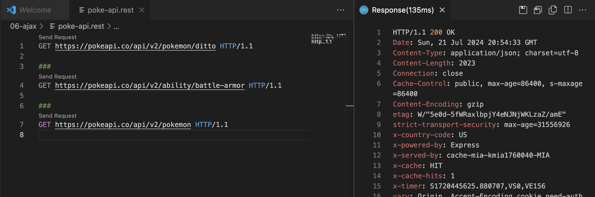

# **UNIDAD 6 - AJAX**

## 1. **Introducción a AJAX**
¿Qué es AJAX?


#### Definición

AJAX, que significa JavaScript Asincrónico y XML, es una técnica utilizada para crear aplicaciones web dinámicas e interactivas. Permite que las páginas web se actualicen de forma asincrónica al intercambiar pequeñas cantidades de datos con el servidor en segundo plano. Esto significa que es posible actualizar partes de una página web sin recargar toda la página.

### **1.1 La Solicitud HTTP**

Una solicitud AJAX es, esencialmente, una solicitud HTTP asincrónica.

HTTP es un protocolo para obtener recursos como documentos HTML. Es la base de cualquier intercambio de datos en la Web y es un protocolo cliente-servidor, lo que significa que las solicitudes son iniciadas por el receptor, generalmente el navegador web. Un documento completo se construye típicamente a partir de recursos como contenido de texto, instrucciones de diseño, imágenes, videos, scripts y más.


Fuente --> [mdn web docs](https://developer.mozilla.org/en-US/docs/Web/HTTP/Overview)

Aquí están los componentes básicos de una solicitud HTTP:

#### Métodos HTTP:

- **GET:** Solicita datos del servidor. Solo debe recuperar datos y no cambiar ningún estado del servidor.
- **POST:** Envía datos para ser procesados a un recurso específico. A menudo causa un cambio en el estado del servidor.
- **PUT:** Actualiza un recurso actual con nuevos datos.
- **PATCH:** Actualiza parte de un recurso actual con nuevos datos.
- **DELETE:** Elimina un recurso específico.

#### URL de Solicitud

La URL especifica el **punto final** al que se envía la solicitud. Es la dirección del recurso.

#### Encabezados

Los encabezados HTTP permiten al cliente y al servidor pasar información adicional con una solicitud o respuesta HTTP.

#### Cuerpo

El cuerpo de una solicitud HTTP contiene los datos que se enviarán al servidor (principalmente utilizados con solicitudes **POST** y **PUT**).
El formato más común para enviar datos es texto plano formateado en JSON.

Ejemplo de solicitud GET y POST:

```http
  GET https://example.com/comments/1 HTTP/1.1

  ###

  GET https://example.com/topics/1 HTTP/1.1

  ###

  POST https://example.com/comments HTTP/1.1
  content-type: application/json
  {
      "name": "sample",
      "time": "Wed, 21 Oct 2015 18:27:50 GMT"
  }
```

#### **[Códigos de Estado de Respuesta HTTP](https://developer.mozilla.org/en-US/docs/Web/HTTP/Status)**

### 1.2 **Entendiendo la Asincronía en JavaScript**

La asincronía es un concepto fundamental en JavaScript que permite a los programas manejar múltiples tareas a la vez sin bloquear el hilo principal. Es crucial para mejorar el rendimiento, especialmente en aplicaciones web, donde operaciones como solicitudes de red, lectura de archivos o temporizadores son comunes.


Por qué es importante la asincronía

1. **Mejora del Rendimiento:** Al manejar tareas de manera concurrente, la aplicación se mantiene receptiva y puede realizar múltiples operaciones de manera eficiente.
2. **Mejor Experiencia del Usuario:** Los usuarios no tienen que esperar a que se completen tareas de larga duración antes de interactuar con la aplicación.
3. **Operaciones No Bloqueantes:** Críticas para solicitudes de red, lectura de archivos y otras operaciones de E/S donde esperar detendría la ejecución del código subsiguiente.

#### Patrones Asincrónicos Comunes

1. **Callbacks:** Funciones pasadas como argumentos a otras funciones para ser ejecutadas más tarde. Pueden llevar a "callback hell" al tratar con múltiples callbacks anidados.

2. **[Promesas](https://developer.mozilla.org/en-US/docs/Web/JavaScript/Reference/Global_Objects/Promise)**:
   
   - Objetos que representan la eventual finalización o falla de una operación asincrónica.
   - Proporcionan métodos como then y catch para manejar casos de éxito y error.

3. **[Async/Await](https://developer.mozilla.org/en-US/docs/Web/JavaScript/Reference/Statements/async_function)**

   - Azúcar sintáctica construida sobre Promesas, proporcionando una forma más legible y concisa de escribir código asincrónico.
   - Requiere el uso de la palabra clave async para definir una función que utiliza await para operaciones asincrónicas.

### 1.3 **Métodos para Hacer Solicitudes Ajax en JS**

#### [Objeto XMLHttpRequest](https://developer.mozilla.org/en-US/docs/Web/API/XMLHttpRequest_API)
- **Descripción**: Un método clásico para realizar solicitudes HTTP. Desarrollado inicialmente en 2006, todavía se utiliza hoy en día. Originalmente tenía problemas de compatibilidad con Internet Explorer, que usaba un nombre diferente para este objeto.
- **Uso**: Aunque es más antiguo y considerado más engorroso, `XMLHttpRequest` todavía es funcional y está soportado en todos los navegadores.

#### [Fetch API](https://developer.mozilla.org/en-US/docs/Web/API/Fetch_API/Using_Fetch)
- **Descripción**: Un método más moderno, potente, flexible y fácil de usar para hacer solicitudes HTTP.
- **Uso**: La Fetch API es ahora la forma preferida de hacer solicitudes HTTP debido a su simplicidad y arquitectura basada en promesas incorporadas.

#### Otros Métodos
- **[Axios](https://axios-http.com/docs/intro)**: Un cliente HTTP basado en promesas para el navegador y Node.js. Es popular por su facilidad de uso y capacidad para manejar solicitudes y respuestas como JSON.
- **[jQuery](https://jquery.com/)**: Una biblioteca de JavaScript rápida, pequeña y rica en características. jQuery proporciona un método simple [`$.ajax`](https://api.jquery.com/Jquery.ajax/) para realizar solicitudes Ajax, lo que simplifica el proceso. La biblioteca jQuery y su método `$.ajax()` tuvieron su momento de gloria facilitando las cosas durante la era de `XMLHttpRequest` y el antiguo Internet Explorer.

## 2. **REST API**

Una REST API (Interfaz de Programación de Aplicaciones de Transferencia de Estado Representacional) es un conjunto de reglas y convenciones para construir e interactuar con servicios web. Las REST APIs permiten que diferentes sistemas **se comuniquen a través de HTTP** utilizando los métodos estándar que hemos visto en el punto anterior, facilitando la integración e interacción con aplicaciones y servicios web.

#### Componentes Clave
- **Punto final:** Una **URL** específica donde se puede acceder a la API.
- **Método:** El tipo de solicitud que se está realizando (por ejemplo, GET, POST, PUT, DELETE, PATCH).
- **Solicitud:** Los datos o acciones que deseas enviar al servidor. En la solicitud se incluyen los **encabezados** y el **cuerpo** si es necesario.
- **Respuesta:** Los datos enviados de vuelta desde el servidor después de procesar la solicitud.


### 2.1 **Herramientas Backend para construir REST API**

Podemos construir una REST API con cualquier lenguaje de servidor:

- PHP
- Java
- Ruby
- Python
- NODE.js 
- ASP.NET

Para construir una API, a menudo usarás un marco de servidor. Algunas opciones populares son:

- **Node.js con [Express](https://expressjs.com/) (JavaScript)**
- **[Django](https://docs.djangoproject.com/en/dev/internals/contributing/writing-code/javascript/) (Python)**
- **[FastAPI](https://fastapi.tiangolo.com/) (Python)**
- **[Ruby on Rails](https://rubyonrails.org/) (Ruby)**
- **[Spring Boot](https://stackabuse.com/build-a-spring-boot-rest-api-with-java-full-guide/) (Java)**


Pero este es un tema de Frontend, así que vamos a usar APIs REST públicas y una API REST de juguete construida con `json-server`.

### 2.2 **API REST Pública**

Las APIs REST públicas proporcionan a los desarrolladores acceso a una variedad de servicios, datos y funcionalidades de diferentes proveedores. Aquí hay una lista de algunas APIs REST públicas comúnmente utilizadas:

##### Redes Sociales y Comunicación

1. **Twitter API**
   - **Descripción:** Permite a los desarrolladores interactuar con datos de Twitter.
   - **Documentación:** [Twitter API Docs](https://developer.twitter.com/en/docs)

2. **Facebook Graph API**
   - **Descripción:** Proporciona acceso a datos del gráfico social de Facebook.
   - **Documentación:** [Facebook Graph API Docs](https://developers.facebook.com/docs/graph-api/)

3. **Slack API**
   - **Descripción:** Permite la integración con Slack para mensajería y colaboración.
   - **Documentación:** [Slack API Docs](https://api.slack.com/)

##### Mapas y Geolocalización

4. **Google Maps API**
   - **Descripción:** Ofrece una amplia gama de servicios relacionados con mapas, incluyendo geolocalización, enrutamiento e información de lugares.
   - **Documentación:** [Google Maps API Docs](https://developers.google.com/maps/documentation)

5. **OpenWeatherMap API**
   - **Descripción:** Proporciona datos meteorológicos, pronósticos e información histórica.
   - **Documentación:** [OpenWeatherMap

 API Docs](https://openweathermap.org/api)

6. **Mapbox API**
   - **Descripción:** Ofrece mapas personalizables y servicios de geolocalización.
   - **Documentación:** [Mapbox API Docs](https://docs.mapbox.com/api/)

##### Finanzas y Criptomonedas

7. **CoinGecko API**
   - **Descripción:** Proporciona datos sobre criptomonedas, incluyendo precios, capitalización de mercado y volumen de negociación.
   - **Documentación:** [CoinGecko API Docs](https://www.coingecko.com/en/api)

8. **Alpha Vantage API**
   - **Descripción:** Ofrece datos financieros, incluyendo precios de acciones, indicadores técnicos y datos de divisas.
   - **Documentación:** [Alpha Vantage API Docs](https://www.alphavantage.co/documentation/)

##### Entretenimiento

9. **Spotify API**
   - **Descripción:** Permite acceso al catálogo musical de Spotify y datos de usuario.
   - **Documentación:** [Spotify API Docs](https://developer.spotify.com/documentation/web-api/)

10. **The Movie Database (TMDb) API**
    - **Descripción:** Proporciona información sobre películas, programas de televisión y actores.
    - **Documentación:** [TMDb API Docs](https://developers.themoviedb.org/3)

11. **YouTube Data API**
    - **Descripción:** Permite acceso a contenido de YouTube y datos de usuario.
    - **Documentación:** [YouTube Data API Docs](https://developers.google.com/youtube/v3)

##### Utilidad y Varios

12. **GitHub API**
    - **Descripción:** Proporciona acceso a repositorios de GitHub, problemas y datos de usuario.
    - **Documentación:** [GitHub API Docs](https://docs.github.com/en/rest)

13. **REST Countries API**
    - **Descripción:** Ofrece información sobre países, incluyendo población, área y ciudades capitales.
    - **Documentación:** [REST Countries API Docs](https://restcountries.com/)

14. **NASA API**
    - **Descripción:** Proporciona acceso a una amplia gama de datos de la NASA, incluyendo imágenes, videos e información planetaria.
    - **Documentación:** [NASA API Docs](https://api.nasa.gov/)

15. **Random User API**
    - **Descripción:** Genera datos de usuario aleatorios, incluyendo nombres, direcciones y fotos de perfil.
    - **Documentación:** [Random User API Docs](https://randomuser.me/)

16. **Open Library API**
    - **Descripción:** Proporciona acceso a datos de libros del proyecto Open Library.
    - **Documentación:** [Open Library API Docs](https://openlibrary.org/developers/api)

17. **PokeAPI**
    - **Descripción:** Ofrece datos del universo Pokémon, incluyendo Pokémon, habilidades y movimientos.
    - **Documentación:** [PokeAPI Docs](https://pokeapi.co/docs/)

> #### <i class="fa-solid fa-circle-check"></i> ¡Verifica esto!
> [Mucho más REST API pública](https://github.com/public-apis/public-apis)

<div class="exercise-box">
  <h3><i class="fas fa-laptop-code"></i> Ejercicio Práctico 1: Creando un archivo .rest para una API REST pública</h3>
  <p>En este ejercicio, crearás un archivo `.rest` utilizando la extensión REST Client para Visual Studio Code. Explorarás una API REST pública gratuita para datos de Pokémon. El archivo debe contener al menos 5 puntos finales diferentes.</p>
  <p>Sigue estos pasos:</p>
  <ol>
    <li>Instala la extensión REST Client para Visual Studio Code si aún no lo has hecho.</li>
    <li>Elige una API REST de acceso gratuito.</li>
    <li>Crea un nuevo archivo llamado `tu-api-elegida.rest` en tu directorio de proyecto.</li>
    <li>Agrega cinco puntos finales diferentes a tu archivo `tu-api-elegida.rest`:</li>
    <li>Prueba los puntos finales.</li>
  </ol>
</div>

Claro, aquí tienes la traducción al español del texto:

---

### 2.3 **Servidor JSON**

[JSON Server](https://www.npmjs.com/package/json-server) es una herramienta poderosa que permite a los desarrolladores crear una API REST falsa completa con un esfuerzo mínimo. Es especialmente útil para desarrolladores frontend que necesitan una forma rápida y sencilla de simular un servidor backend sin configurar un entorno de servidor completo. Con JSON Server, puedes crear rápidamente una API simulada, probar tu código frontend y prototipar aplicaciones sin necesidad de un backend real.

#### Características Clave

- **Sin Necesidad de Programación:** Crea una API completa a partir de un simple archivo JSON.
- **Configuración Extremadamente Rápida:** Pon en marcha una API simulada en minutos.
- **Rutas RESTful:** Genera automáticamente rutas RESTful basadas en tus datos.
- **Operaciones CRUD:** Soporta operaciones de Crear, Leer, Actualizar y Eliminar.
- **Rutas Personalizadas:** Permite definir rutas personalizadas y agregar middleware para configuraciones más complejas.
- **Servicio de Archivos Estáticos:** Puede servir archivos estáticos junto con la API, útil para servir tu aplicación frontend.

<div class="exercise-box">
  <h3><i class="fas fa-laptop-code"></i> Ejercicio Práctico: Crear una API Falsa con JSON Server</h3>
  <p>En este ejercicio, crearás una API REST falsa usando JSON Server. Esto te ayudará a entender cómo simular un backend para tu desarrollo frontend. Sigue los pasos a continuación para configurar y ejecutar tu API falsa:</p>

  <h4>Pasos para Crear una API Falsa</h4>

  <ol>
    <li>
      <strong>Instala JSON Server:</strong>
      <p>Primero, asegúrate de tener Node.js instalado. Luego, instala JSON Server globalmente usando npm.</p>
      <pre><code>npm install -g json-server</code></pre>
    </li>
    <li>
      <strong>Crea un Archivo <code>db.json</code>:</strong>
      <p>En tu directorio de proyecto, crea un archivo llamado <code>db.json</code>. Este archivo contendrá tus datos falsos. A continuación, se muestra una estructura de ejemplo para una API simple:</p>
      <pre><code> {
  "posts": [
    { "id": 1, "title": "Hola Mundo", "author": "John Doe" },
    { "id": 2, "title": "Aprendiendo JSON Server", "author": "Jane Doe" }
  ],
  "comments": [
    { "id": 1, "postId": 1, "body": "¡Gran publicación!" },
    { "id": 2, "postId": 2, "body": "Muy informativa." }
  ],
  "profile": { "name": "John Doe" }
}</code></pre>
    </li>
    <li>
      <strong>Inicia JSON Server:</strong>
      <p>Ejecuta JSON Server con el archivo <code>db.json</code> que creaste.</p>
      <pre><code>npx json-server db.json</code></pre>
    </li>
    <li>
      <strong>Accede a Tu API Falsa:</strong>
      <p>Una vez que JSON Server esté en funcionamiento, puedes acceder a tu API falsa en <code>http://localhost:3000</code>. Aquí hay algunos ejemplos de endpoints basados en el archivo <code>db.json</code>:</p>
      <ul>
        <li><code>GET /posts</code> - Listar todas las publicaciones</li>
        <li><code>GET /posts/1</code> - Obtener una publicación específica por ID</li>
        <li><code>POST /posts</code> - Crear una nueva publicación</li>
        <li><code>PUT /posts/1</code> - Actualizar una publicación por ID</li>
        <li><code>DELETE /posts/1</code> - Eliminar una publicación por ID</li>
        <li><code>GET /comments</code> - Listar todos los comentarios</li>
        <li><code>GET /profile</code> - Obtener el perfil</li>
      </ul>
    </li>
    <li>
      <strong>Realiza Solicitudes a Tu API Falsa:</strong>
      <p>Utiliza herramientas como Postman, cURL, o la extensión REST Client en Visual Studio Code para hacer solicitudes a tus endpoints de API falsa y observar las respuestas.</p>
    </li>
  </ol>
  <p>Experimenta con diferentes estructuras de datos y endpoints para familiarizarte con el funcionamiento de JSON Server. Esta es una herramienta poderosa para configurar rápidamente un backend simulado que ayude en el desarrollo frontend.</p>
</div>

## 3. **Diferentes Soluciones para Probar Tu API REST**

Al desarrollar y probar APIs REST, es esencial tener herramientas que te ayuden a hacer solicitudes a tus endpoints e inspeccionar las respuestas.

Podemos simplemente pegar la URL del endpoint en la barra de direcciones del navegador cuando tenemos una solicitud GET simple.

Intenta pegar esto en tu navegador:

```
https://pokeapi.co/api/v2/pokemon/ditto
```

Podemos mejorar la respuesta JSON mostrada en el navegador con algún complemento para Chrome como [JSON Viewer](https://chromewebstore.google.com/detail/json-viewer/gbmdgpbipfallnflgajpaliibnhdgobh).

También podemos usar el comando [curl](https://linuxize.com/post/curl-rest-api/) para probar un endpoint en la línea de comandos.

Pero cuando tenemos solicitudes más complicadas, como POST con cargas útiles y encabezados más complejos, preferimos usar una opción más robusta.

Aquí hay tres soluciones populares:

### 3.1 **Postman**

#### Descripción General
Postman es un entorno completo para el desarrollo de APIs que te permite crear, compartir, probar y documentar APIs. Tiene una interfaz amigable y ofrece una amplia gama de características.

#### Características Clave
- **Colecciones:** Organiza tus solicitudes API en colecciones para una mejor gestión y colaboración.
- **Variables de Entorno:** Cambia fácilmente entre diferentes entornos (por ejemplo, desarrollo, pruebas, producción) usando variables.
- **Pruebas Automatizadas:** Crea scripts de prueba usando JavaScript para automatizar las pruebas de la API.
- **Servidores Simulados:** Simula endpoints de API con fines de prueba sin necesidad del servidor real.
- **Colaboración:** Comparte colecciones y espacios de trabajo con miembros del equipo para mejorar la colaboración.


#### Ejemplo de Uso
1. Crea una nueva solicitud.
2. Establece el método HTTP (GET, POST, PUT, DELETE, etc.).
3. Ingresa la URL del endpoint de la API.
4. Agrega encabezados, parámetros de consulta y cuerpo de la solicitud si es necesario.
5. Haz clic en el botón "Enviar" para realizar la solicitud e inspeccionar la respuesta.

#### Descargar
[Descargar Postman](https://www.postman.com/downloads/)

### 3.2 **Thunder Client**

#### Descripción General
Thunder Client es un cliente REST API ligero para la extensión Visual Studio Code (VSCode). Está diseñado para ser simple y fácil de usar dentro del entorno de VSCode.

#### Características Clave
- **Integrado con VSCode:** No es necesario cambiar entre aplicaciones; úsalo directamente dentro de tu editor de código.
- **Variables de Entorno:** Gestiona variables de entorno para cambiar fácilmente entre diferentes configuraciones.
- **Colecciones:** Organiza tus solicitudes en colecciones para una mejor estructura.
- **Pruebas Rápidas:** Capacidades básicas de prueba para validar tus respuestas de API.
- **Ligero:** Diseño minimalista con características esenciales para pruebas de API rápidas y eficientes.

#### Ejemplo de Uso
1. Instala la extensión Thunder Client en VSCode.
2. Abre el panel de Thunder Client desde la barra lateral.
3. Crea una nueva solicitud y establece el método HTTP.
4. Ingresa la URL del endpoint de la API.
5. Agrega encabezados, parámetros de consulta y cuerpo de la solicitud si es necesario.
6. Haz clic en el botón "Enviar" para realizar la solicitud y ver la respuesta.


#### Descargar
[Descargar Thunder Client](https://marketplace.visualstudio.com/items?itemName=rangav.vscode-thunder-client)

### 3.3 **REST Client**

#### Descripción General
REST Client es otra extensión de VSCode que te permite enviar solicitudes HTTP y ver las respuestas directamente en tu editor de código. Es ideal para aquellos que prefieren un enfoque más centrado en el código.

#### Características Clave
- **Archivos de Solicitud:** Escribe tus solicitudes en archivos `.http` o `.rest` para mejor organización y control de versiones.
- **Variables de Entorno:** Usa variables de entorno para gestionar diferentes configuraciones para tus solicitudes API.
- **Documentación en Línea:** Documenta tus solicitudes en línea con tu código para una mejor legibilidad.
- **Soporte para Varios Métodos HTTP:** Envía fácilmente solicitudes GET, POST, PUT, DELETE y otros tipos de solicitudes HTTP.

#### Ejemplo de Uso
1. Instala la extensión REST Client en VSCode.
2. Crea un nuevo archivo `.http` o `.rest`.
3. Escribe tu solicitud, por ejemplo:

```http
GET https://example.com/comments/

1 HTTP/1.1

###

GET https://example.com/topics/1 HTTP/1.1

###

POST https://example.com/comments HTTP/1.1
content-type: application/json
{
    "name": "muestra",
    "time": "Wed, 21 Oct 2015 18:27:50 GMT"
}
```
4. Haz clic en el enlace "Enviar Solicitud" encima de la solicitud para ejecutarla y ver la respuesta en un panel dividido.



#### Descargar
[Descargar REST Client](https://marketplace.visualstudio.com/items?itemName=humao.rest-client)

## 4. **XMLHttpRequest**

No vamos a usar esta forma más antigua, pero podemos ver este pequeño ejemplo para entenderlo.

```js
// Crea un nuevo objeto XMLHttpRequest
var xhr = new XMLHttpRequest();

// Configúralo: solicitud GET para la URL /users
xhr.open('GET', 'https://jsonplaceholder.typicode.com/users', true);

// Configura una función para manejar la respuesta
xhr.addEventListener("load", function () {
  if (xhr.status >= 200 && xhr.status < 300) {
    // Analiza la respuesta JSON
    var users = JSON.parse(xhr.responseText);

    // Registra la respuesta en la consola
    console.log(users);

    // Muestra la respuesta en el elemento <pre>
    document.getElementById('responseOutput').textContent = JSON.stringify(users, null, 2);
  } else {
    console.error('La solicitud falló. Código de estado devuelto: ' + xhr.status);
  }
});

// Manejar errores de red
xhr.addEventListener("error", function () {
  console.error('La solicitud falló.');
})

// Envía la solicitud
xhr.send();
```

## 5. **Fetch API**

En el desarrollo web moderno, Fetch simplifica y mejora muchos aspectos de las conexiones AJAX. Es ahora compatible con la mayoría de los navegadores, lo que lo convierte en una opción preferida para manejar solicitudes asíncronas.

#### Métodos Clave para Manejar la Asincronía con Fetch:
1. **Promesas**
2. **async / await**
   
##### [--> Enlace a Fetch en MDN](https://developer.mozilla.org/en-US/docs/Web/API/Fetch_API/Using_Fetch)

### 5.1 **Fetch con Promesas**

La API Fetch utiliza [Promesas](https://developer.mozilla.org/en-US/docs/Web/JavaScript/Reference/Global_Objects/Promise) para manejar operaciones asíncronas. Aquí hay un ejemplo básico de cómo usar Fetch con Promesas:

```js
// Esta es una solicitud GET con promesas
fetch('https://jsonplaceholder.typicode.com/posts/1')
  .then(response => {
    // analiza la respuesta JSON
    return response.json();
  })
  .then(data => {
      // Haz algo con los datos
      document.getElementById('output').innerText = JSON.stringify(data);
  })
  .catch(error => console.error('Error:', error));
```

### 5.2 **Fetch con Async/Await**

La sintaxis [async/await](#52-fetch-with-asyncawait) proporciona una forma más limpia y legible de manejar operaciones asíncronas. Es importante notar que `await` solo puede usarse dentro de una función `async`. Aquí te mostramos cómo usar Fetch con async/await:

```js
// Esta es una solicitud GET con async/await
async function fetchData() {
    try {
        const response = await fetch('https://jsonplaceholder.typicode.com/posts/1');
        // analiza la respuesta JSON
        const data = await response.json();
        // haz algo con los datos
        console.log(data);
        return data;
    } catch (error) {
        console.error('Error:', error);
    }
}
```


Claro, aquí tienes la traducción al español:

### 5.3 **Manejo de Respuestas HTTP**

El objeto `Response` en la API Fetch proporciona varios métodos para manejar y formatear las respuestas HTTP. Cada uno de estos métodos devuelve una promesa que se resuelve a diferentes tipos de datos.

- `response.json()`: Devuelve una promesa resuelta a un objeto JSON.
- `response.text()`: Devuelve una promesa resuelta a texto sin formato.
- `response.formData()`: Devuelve una promesa resuelta a `formData`.
- `response.blob()`: Devuelve una promesa resuelta a un `Blob` (un objeto similar a un archivo de datos binarios).

#### `response.json()`

Este es el que utilizaremos la mayoría de las veces, porque JSON es el formato más común que las API nos ofrecen para los datos.

- Devuelve una promesa resuelta a un objeto JSON.
- Útil para manejar respuestas que contienen datos JSON.
  
```javascript
fetch('https://api.ejemplo.com/datos')
    .then(response => response.json())
    .then(data => console.log(data))
    .catch(error => console.error('Error:', error));
```

#### Información sobre el Estado de la Conexión

El objeto `Response` también proporciona información sobre el estado de la conexión:

#### `response.status`

- Devuelve el código de estado de la respuesta.
- Los valores típicos incluyen:
    - `100-199`: Respuestas informativas.
    - `200-299`: Respuestas exitosas.
          - `200`: OK.
    - `300-399`: Mensajes de redirección.
    - `400-499`: Respuesta de error del cliente.
          - `404`: No encontrado.
    - `500-599`: Respuestas de error del servidor.
          - `500`: Error interno del servidor.
    - [Todos los códigos de estado de respuesta HTTP](https://developer.mozilla.org/en-US/docs/Web/HTTP/Status)
```js
fetch('https://api.ejemplo.com/datos')
    .then(response => {
        console.log(response.status); // por ejemplo, 200, 404, 500
        return response.json();
    })
    .then(data => console.log(data))
    .catch(error => console.error('Error:', error));
```

#### `response.ok`

- Devuelve un booleano que indica si la respuesta fue exitosa (código de estado en el rango 200-299).

```js
fetch('https://api.ejemplo.com/datos')
    .then(response => {
        if (response.ok) {
            return response.json();
        } else {
            throw new Error('La respuesta de la red no fue correcta');
        }
    })
    .then(data => console.log(data))
    .catch(error => console.error('Error:', error));
```

### 5.3 **Solicitudes GET, POST, PUT, PATCH, DELETE**

Como puedes ver, si no especificas un método, el método por defecto es GET. En los ejemplos anteriores hemos creado solicitudes GET. No hemos definido `method`, `body` o `headers` en las opciones de fetch.

Cuando se trata de solicitudes POST, PUT y PATCH, necesitamos incluir `method`, `body` y `headers` como opciones de fetch.

#### Solicitudes GET:

- Para solicitudes GET, generalmente no necesitamos incluir un encabezado Content-Type. Las solicitudes GET no tienen cuerpo, por lo que no hay un tipo de contenido que especificar.
- Sin embargo, podemos enviar algunos datos como parámetros cuando el punto final de la API lo permite.
- Pero quizás necesitemos incluir información en el encabezado, como `'Authorization'` en los casos en que sea necesario.

Ejemplo:

```js
// Ejemplo de solicitud GET simple
fetch('https://api.ejemplo.com/get-images?query=gatos&limit=20')
    .then(response => response.json())
    .then(data => console.log(data))
    .catch(error => console.error('Error:', error));

// GET con autorización requerida
fetch('https://api.ejemplo.com/get-images?query=gatos&limit=20', {
  headers: {
        'Authorization': 'Bearer tu-api-key'
    },
})
    .then(response => response.json())
    .then(data => console.log(data))
    .catch(error => console.error('Error:', error));
```

#### Solicitudes POST, PUT, PATCH:

Para estos tipos de solicitudes que crean o modifican un recurso, necesitamos enviar un `body`. Será necesario incluir:

- Encabezado `Content-Type` para especificar el tipo de contenido
      - Valores comunes para el encabezado Content-Type incluyen `application/json`, `application/x-www-form-urlencoded`, `multipart/form-data`, etc.
- `method`:
      - `'POST'`
      - `'PUT'`
      - `'PATCH'`
- `body`: La mayoría de las veces, cuando `Content-Type` es JSON, tenemos que 'stringify' algún objeto de datos:
      - `body: JSON.stringify(data)`

Ejemplos:
```js
const BASE_URL = 'https://api.ejemplo.com';
const API_KEY = 'tu-api-key';

// Función para manejar solicitudes POST
export async function postData(endpoint, body) {
    try {
        const response = await fetch(`${BASE_URL}${endpoint}`, {
            method: 'POST',
            headers: {
                'Authorization': `Bearer ${API_KEY}`,
                'Content-Type': 'application/json'
            },
            body: JSON.stringify(body)
        });
        if (!response.ok) {
            throw new Error(`Error: ${response.statusText}`);
        }
        const data = await response.json();
        return data;
    } catch (error) {
        console.error('Error al enviar datos:', error);
        throw error;
    }
}

// Función para manejar solicitudes PUT
export async function putData(endpoint, body) {
    try {
        const response = await fetch(`${BASE_URL}${endpoint}`, {
            method: 'PUT',
            headers: {
                'Authorization': `Bearer ${API_KEY}`,
                'Content-Type': 'application/json'
            },
            body: JSON.stringify(body)
        });
        if (!response.ok) {
            throw new Error(`Error: ${response.statusText}`);
        }
        const data = await response.json();
        return data;
    } catch (error) {
        console.error('Error al actualizar datos:', error);
        throw error;
    }
}
```

#### Solicitudes DELETE

- El método DELETE se utiliza para eliminar un recurso identificado por una URL. Al igual que el método GET, el método DELETE generalmente no necesita un cuerpo y, por lo tanto, no suele requerir un encabezado `Content-Type`. Sin embargo, hay algunos escenarios en los que podrías necesitar incluir un cuerpo con una solicitud DELETE y también podría ser necesario incluir información en el encabezado como `'Authorization'`.

Ejemplo:
```js
// Función de eliminación simple sin opciones
export async function simpleDeleteData(endpoint) {
    try {
        const response = await fetch(`${BASE_URL}${endpoint}`, {
          method: 'DELETE'
        });
        if (!response.ok) {
            throw new Error(`Error: ${response.statusText}`);
        }
        const data = await response.json();
        return data;
    } catch (error) {
        console.error('Error al eliminar datos:', error);
        throw error;
    }
}

// Función más avanzada, con algunas opciones
export async function deleteData(endpoint, body = null) {
    try {
        const options = {
            method: 'DELETE',
            headers: {
                'Authorization': `Bearer ${API_KEY}`
            }
        };
        // Si se pide un cuerpo, lo stringify
        if (body) {
            options.headers['Content-Type'] = 'application/json';
            options.body = JSON.stringify(body);
        }
        const response = await fetch(`${BASE_URL}${endpoint}`, options);
        if (!response.ok) {
            throw new Error(`Error: ${response.statusText}`);
        }
        const data = await response.json();
        return data;
    } catch (error) {
        console.error('Error al eliminar datos:', error);
        throw error;
    }
}
```

</div>
Claro, aquí tienes la traducción al español:

### 5.4 **Encapsular Solicitudes Fetch en Módulos Reutilizables**

Siempre es una buena práctica encapsular las solicitudes `fetch` a nuestra API en un módulo de JavaScript separado que podamos importar en el módulo principal. Para este propósito, debemos utilizar [Módulos de Ecma Script](https://developer.mozilla.org/en-US/docs/Web/JavaScript/Guide/Modules) (ESM).

1. **Importar el Script Principal como un Módulo**

   ```html
   <script src="your-main.js" type="module"></script>
   ```

2. **Crear el Módulo `your-api.js`**

   Crea un archivo de JavaScript separado llamado `your-api.js` que encapsule toda la lógica para acceder a la API. Este módulo contendrá constantes, como la URL base y las claves de la API, así como funciones para realizar solicitudes a la API.

   ```js
   // your-api.js

   const BASE_URL = 'https://api.example.com';
   const API_KEY = 'your-api-key';

   // Función para manejar solicitudes GET
   export async function fetchData(endpoint) {
       try {
           const response = await fetch(`${BASE_URL}${endpoint}`, {
               headers: {
                   'Authorization': `Bearer ${API_KEY}`,
                   'Content-Type': 'application/json'
               }
           });
           if (!response.ok) {
               throw new Error(`Error: ${response.statusText}`);
           }
           const data = await response.json();
           return data;
       } catch (error) {
           console.error('Error al Obtener Datos:', error);
           throw error;
       }
   }

   // Función para manejar solicitudes POST
   export async function postData(endpoint, body) {
       try {
           const response = await fetch(`${BASE_URL}${endpoint}`, {
               method: 'POST',
               headers: {
                   'Authorization': `Bearer ${API_KEY}`,
                   'Content-Type': 'application/json'
               },
               body: JSON.stringify(body)
           });
           if (!response.ok) {
               throw new Error(`Error: ${response.statusText}`);
           }
           const data = await response.json();
           return data;
       } catch (error) {
           console.error('Error al Publicar Datos:', error);
           throw error;
       }
   }

   // Otras funciones relacionadas con la API se pueden agregar aquí
   ```

3. **Importar y Usar el Módulo de API en el Script Principal**

   En tu archivo principal de JavaScript, `your-main.js`, importa las funciones del módulo `your-api.js` y úsalas para realizar solicitudes a la API.

   ```js
   // your-main.js
   import { fetchData, postData } from './your-api.js';

   async function main() {
       try {
           // Ejemplo de realizar una solicitud GET
           const data = await fetchData('/some-endpoint');
           console.log('Datos Obtenidos:', data);

           // Ejemplo de realizar una solicitud POST
           const postDataBody = { key: 'value' };
           const postDataResponse = await postData('/some-endpoint', postDataBody);
           console.log('Datos Publicados:', postDataResponse);
       } catch (error) {
           console.error('Error en la Función Principal:', error);
       }
   }

   // Ejecutar la función principal
   main();
   ```

<div class="important-box">
<h3><i class="fa-solid fa-circle-exclamation"></i>IMPORTANTE</h3>
<p>A partir de ahora, es <strong>OBLIGATORIO</strong> encapsular las funciones fetch de cada API a la que accedemos en nuestro proyecto en un <strong>módulo separado</strong>.</p>
</div>