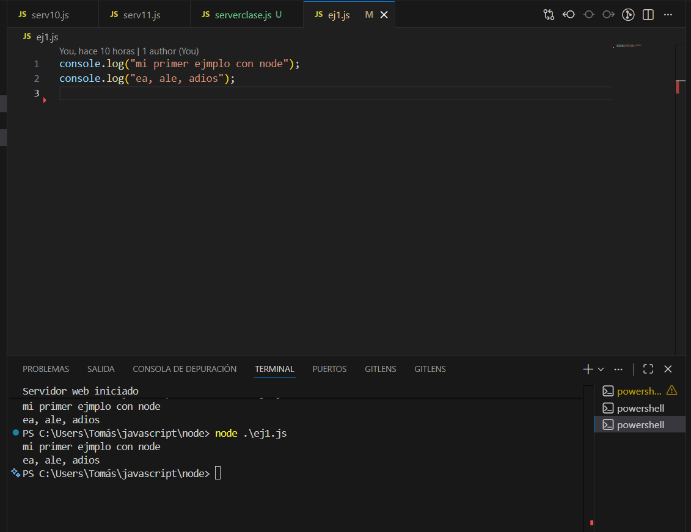

# **UNIDAD 8 - NODE JS>**

## 1. **Introducción**

En esta unidad pretendo desarrollar el tema de Node JS.
Mientras no haga mi propio material, podéis utilizar el tutorial de [programación ya](https://www.tutorialesprogramacionya.com/javascriptya/nodejsya/).

Todo el código que vaya desarrollando estará en [este repo de github](https://github.com/tmartin1284/node)

### Presentación de Node

Node.js es una plataforma para el desarrollo de aplicaciones en JavaScript que se ejecutan fundamentalmente en un equipo servidor. Node.js se basa en el lenguaje JavaScript v8 y nos permite entre otras hacer las siguientes funcionalidades:

- Generar páginas dinámicas en un servidor web.
- Acceder a bases de datos relacionales (MySQL, SqlServer etc.) y no relacionales (MongoDB, CouchDB, Cassandra etc.)
- Crear, leer y escribir archivos.
- Recuperar datos de formularios HTML.
- Procesar y almacenar archivos enviados desde una página web.
- Generar y enviar a aplicaciones cliente (navegador web, aplicación móvil etc.) archivos JSON
- Interactuar con sitios de una sola página (SPA) creados en Angular, React, Vue etc.

## 2. Instalación de Node.js

Lo primero que haremos es instalar el Node.js que lo podemos descargar de [la página oficial de node.js](https://nodejs.org/es) (Hay una versión recomendada y es la que instalaremos). De hecho si tenéis una instalación anterior, os bajáis la nueva versión, la instalais y listo. El proceso de instalación es el típico de windows: _si_, _siguiente_, _aceptar_ (_and repeat_).

Una vez instalado, simplemente abrimos un terminal del sistema, y ya podemos utilizar node.js, tecleando _node_. . Aunque la opción más cómoda es hacerlo a través del VSCode, abriendo el proyecto donde guardaremos las cosas de node.js y ejecutando en el terminal del VSCode _node_ .

## 3. Primeros pasos con Node.js

El código que escribimos con _node.js_ es prácticamente similar al código de Javascript.

```js
console.log("mi primer ejemplo con node");
console.log("ea, ale, adios");
```

En este caso, el servidor está registrando dos mensajes en su log, y la salida por tanto que dará al ejecutarlo es .

### Módulos y su uso

_node.js_ estructura el código en módulos, que no son más que el archivo en el que está escrita la funcionalidad. Por ejemplo, definimos una serie de funciones matemáticas básicas en un módulo llamado operacionesmatemáticas:

```js
const PI = 3.14;

function sumar(num_a, num_b) {
  return num_a + num_b;
}

function restar(num_a, num_b) {
  return num_a - num_b;
}

function dividir(num_a, num_b) {
  if (num_b == 0) {
    mostrarErrorDivision();
  } else {
    return num_a / num_b;
  }
}

function mostrarErrorDivision() {
  console.log("No se puede dividir por cero");
}
```

Estas funciones serán accesibles, sólo si están exportadas:

```js
module.exports = {
  sumar,
  dividir,
  PI,
};
```

En este caso, la función _mostrarErrorDivisión()_ no se puede llamar desde el exterior del módulo (es privada). Y la función _restar_ tampoco.

Los módulos se importan declarandolos como una constante que se inicializa con la función _require(path)_ e indicando la ruta donde se encuentra el módulo a importar.
Sobre esta constante se podrán ejecutar las funciones exportadas:

```js
const mat = require("./matematica");

console.log("La suma de 2+2=" + mat.sumar(2, 2));
console.log("La división de 6/3=" + mat.dividir(6, 3));
console.log("El valor de PI=" + mat.PI);
console.log("La resta de 4-1=" + mat.restar(4, 1));
```

En este caso [ejecución](./img/im4.png) vemos que ejecuta sin problema las funciones exportadas, pero da error al intentar acceder a resta, que aunque está definida, no se exporta.

### Módulo _fs_ y _fs/promises_

### Módulo _http_

```

```
